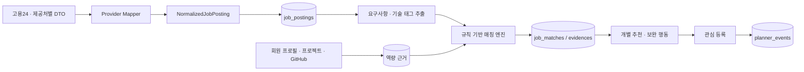

# JobPilot AI — IT 취준생 커리어 액션 코치

IT 웹 개발 취준생의 **프로젝트·기술·자격·GitHub 근거**를 고용 정보와 비교해, 지금 검토할 공고와 다음 준비 행동을 보여 주는 Spring + React 템플릿입니다.

> 이 서비스의 등급과 점수는 합격 가능성 또는 최종 지원 자격 판정이 아닙니다. 공고의 필수 요건과 사용자가 등록한 근거의 연결 정도를 설명하는 **지원 준비도**입니다.

## 1차 목표

1. 고용24 등 공식 제공처의 IT 채용공고를 공통 형식으로 가져온다.
2. 회원의 기술·프로젝트·자격증·교육·희망 조건을 공고의 필수/우대 조건과 비교한다.
3. `지원 조건 충족 가능`, `보완 후 도전 가능`, `현재 근거 부족` 3단계로 보여 준다.
4. 앞의 두 등급만 개인 추천하고, 근거와 보완 행동을 함께 보여 준다.
5. 교육·자격증·공모전·청년지원 기회를 부족 역량과 연결한다.
6. 관심 등록한 공고·기회를 플래너 마감/기간 일정으로 자동 생성한다.

## 화면 템플릿

데모 데이터는 더 이상 화면 파일에 섞여 있지 않습니다. 각 도메인의 `data/*.fixture.ts`는 `api/*.ts`의 fallback으로만 사용되며, Spring API가 준비되면 `VITE_API_BASE_URL`만 설정해 같은 화면을 실제 응답으로 전환할 수 있습니다.

| 화면 | 사용자가 확인하는 핵심 |
|---|---|
| 대시보드 | 지원 검토 공고, 오늘의 보완 행동, 관심 일정 |
| 맞춤 채용공고 | 등급 필터, 출처 배지, 공고별 근거 매트릭스 |
| 성장 기회 추천 | 부족 역량 ↔ 교육·자격증·공모전 연결 |
| 나의 플래너 | 관심 등록으로 자동 생성된 마감·시험·교육 일정 |
| 역량 프로필 | 기술이 아니라 프로젝트·GitHub·교육·자격 근거 관리 |

## 코드 구조

```text
frontend/src
├─ app/router.tsx                 # URL 라우팅만 담당
├─ layouts/AppShell.tsx           # 사이드바·상단바 공통 레이아웃
├─ pages/                         # 화면 조립과 페이지 상태만 담당
├─ api/httpClient.ts              # 공통 HTTP 진입점
├─ shared/                        # 여러 도메인이 함께 쓰는 UI·상수
└─ features/
   ├─ jobs/{api,components,data,model}
   ├─ opportunities/{api,components,data,model}
   ├─ planner/{api,components,data,model}
   ├─ profile/{components,data,model}
   └─ interests/{api,model}       # 관심 상태 및 관심 API

backend/src/main/java/com/jobpilot/api
├─ global/{health,exception}      # 도메인 공통 관심사
└─ domain/
   ├─ jobposting/{entity,repository}
   └─ matching/{controller,dto,entity,policy,repository,service}
```

프론트엔드에서 controller/repository 패턴을 억지로 흉내 내지 않습니다. 프론트는 `pages → features → api/model`로 분리하고, 실제 controller·service·repository·dto는 Spring의 각 도메인 안에 둡니다.

UI는 제공해 주신 두 참고 프로젝트에서 다음 **레이아웃 원칙만** 참고해 새로 구성했습니다.

- `kr-tech-recruitment-main`: 공고 카드, 출처 표시, 탐색 중심의 목록 구조
- `PROJECT 2`: 개인 워크스페이스, 사이드바, 대시보드/진행 현황 구조

## 실행

### 프론트엔드 데모

```powershell
cd D:\Final_Project\jobpilot-ai\frontend
npm install
npm run dev
```

브라우저에서 `http://localhost:5173`을 엽니다. 현재는 데모 데이터가 표시되며, 관심 버튼을 누르면 플래너의 관심 개수가 즉시 바뀝니다.

### MySQL과 Spring Boot 골격

```powershell
cd D:\Final_Project\jobpilot-ai
docker compose up -d mysql
cd backend
mvn spring-boot:run
```

시작 확인은 `GET http://localhost:8080/api/v1/health`입니다.

## 아키텍처



## DB 원칙

- 제공처별 테이블을 만들지 않고, 모든 공고는 `job_postings`에 정규화합니다.
- 원문 링크·출처·수집 시각을 공고마다 보존합니다.
- `(source_id, external_job_id)`는 유일해야 합니다.
- 매칭의 핵심은 `job_match_evidences`입니다. 각 공고 요건마다 연결한 회원 근거와 상태를 저장합니다.
- 공고·기회를 관심 해제하거나 일정에서 지워도 원본 데이터와 분석 이력은 지우지 않습니다.
- API 키·OAuth secret은 `.env` 또는 배포 환경의 Secret Manager에만 저장합니다.

전체 테이블 정의는 [`backend/src/main/resources/db/migration/V1__core_schema.sql`](backend/src/main/resources/db/migration/V1__core_schema.sql)에 있습니다.

## 등급 정책

`backend/src/main/java/com/jobpilot/api/domain/matching/policy/MatchPolicy.java`는 LLM과 분리된 초기 판정 정책입니다.

| 등급 | 기준 |
|---|---|
| `READY_TO_APPLY` | 명시적 불가 조건이 없고, 필수 요건이 직접 근거 중심으로 모두 커버됨 |
| `NEEDS_IMPROVEMENT` | 지원 불가 조건은 없으나 관련 경험·우대 기술·포트폴리오 설명을 보완해야 함 |
| `INSUFFICIENT_EVIDENCE` | 필수 기술/경력/지역/자격의 큰 공백이 있거나 근거가 충분하지 않음 |

점수는 목록 정렬용 보조 수치입니다. 화면의 핵심은 반드시 요구사항별 `DIRECT`, `RELATED`, `MISSING`, `CHECK_REQUIRED` 근거 표입니다.

## 다음 구현 순서

1. Spring Security + JWT, 회원/프로필/프로젝트 CRUD
2. 기술 사전(`skills`, `skill_aliases`) 초기 데이터와 회원 근거 연결
3. 고용24 Provider DTO → `NormalizedJobPosting` → upsert
4. 공고 요구사항/기술 태그 추출과 매칭 API
5. React fixture를 실제 API로 교체
6. 관심 → `planner_events` 트랜잭션 구현
7. GitHub OAuth 및 사용자가 선택한 공개 저장소만 프로젝트 근거로 저장

구체적인 API 형태는 [`docs/api-contract.md`](docs/api-contract.md), 화면별 동작은 [`docs/product-spec.md`](docs/product-spec.md)에 정리했습니다.
