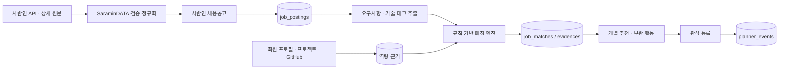

# JobPilot AI — IT 취준생 커리어 액션 코치

IT 웹 개발 취준생의 **프로젝트·기술·자격·GitHub 근거**를 고용 정보와 비교해, 지금 검토할 공고와 다음 준비 행동을 보여 주는 Spring + React 템플릿입니다.

> 이 서비스의 등급과 점수는 합격 가능성 또는 최종 지원 자격 판정이 아닙니다. 공고의 필수 요건과 사용자가 등록한 근거의 연결 정도를 설명하는 **지원 준비도**입니다.

## 1차 목표

1. 사람인 API와 허용된 상세 수집으로 IT 채용공고를 구조화한다.
2. 회원의 스펙·기술·프로젝트·자격증·교육·자소서를 공고의 필수/우대 조건과 비교한다.
3. `지금도 지원해볼 만함`, `요건 보완 후 도전 가능`, `현재는 지원이 어려움` 3단계로 보여 준다.
4. 판정마다 공고 문장, 회원 근거, 부족 요건과 다음 행동을 함께 보여 준다.
5. 교육·자격증·공모전·청년지원 기회를 부족 역량과 연결한다.
6. 관심 등록한 공고·기회를 플래너 마감/기간 일정으로 자동 생성한다.

## 화면 템플릿

하드코딩된 데모 데이터와 API 실패 시 fallback은 제거했습니다. Spring API가 꺼져 있거나 응답하지 않으면 화면에는 예시 공고 대신 연결 오류 또는 빈 상태가 표시됩니다.

| 화면 | 사용자가 확인하는 핵심 |
|---|---|
| 대시보드 | 지원 검토 공고, 오늘의 보완 행동, 관심 일정 |
| 맞춤 채용공고 | 등급 필터, 출처 배지, 공고별 근거 매트릭스 |
| 성장 기회 추천 | 부족 역량 ↔ 교육·자격증·공모전 연결 |
| 나의 플래너 | 관심 등록으로 자동 생성된 마감·시험·교육 일정 |
| 역량 프로필 | 기술이 아니라 프로젝트·GitHub·교육·자격 근거 관리 |

## 코드 구조

```text
frontend/src
├─ app/router.tsx                 # URL 라우팅만 담당
├─ layouts/AppShell.tsx           # 사이드바·상단바 공통 레이아웃
├─ pages/                         # 화면 조립과 페이지 상태만 담당
├─ api/httpClient.ts              # 공통 HTTP 진입점
├─ shared/                        # 여러 도메인이 함께 쓰는 UI·상수
└─ features/
   ├─ jobs/{api,components,data,model}
   ├─ opportunities/{api,components,data,model}
   ├─ planner/{api,components,data,model}
   ├─ profile/{components,data,model}
   └─ interests/{api,model}       # 관심 상태 및 관심 API

backend/src/main/java/com/jobpilot/api
├─ global/{health,exception}      # 도메인 공통 관심사
└─ domain/
   ├─ jobposting/{entity,repository}
   └─ matching/{controller,dto,entity,policy,repository,service}
```

프론트엔드에서 controller/repository 패턴을 억지로 흉내 내지 않습니다. 프론트는 `pages → features → api/model`로 분리하고, 실제 controller·service·repository·dto는 Spring의 각 도메인 안에 둡니다.

UI는 제공해 주신 두 참고 프로젝트에서 다음 **레이아웃 원칙만** 참고해 새로 구성했습니다.

- `kr-tech-recruitment-main`: 공고 카드, 출처 표시, 탐색 중심의 목록 구조
- `PROJECT 2`: 개인 워크스페이스, 사이드바, 대시보드/진행 현황 구조

## 실행

### 프론트엔드

```powershell
cd C:\Final_Project\jobpilot-ai\frontend
npm install
npm run dev
```

브라우저에서 `http://localhost:5173`을 열고 `/signup`에서 가입합니다. 로그인 후 보호된 화면을 사용할 수 있으며, 데이터는 Spring API와 MySQL에서만 읽습니다.

### MySQL과 Spring Boot 골격

```powershell
cd C:\Final_Project\jobpilot-ai
docker compose up -d mysql
cd backend
mvn spring-boot:run
```

시작 확인은 `GET http://localhost:8080/api/v1/health`입니다.

### JWT 회원가입·로그인

```http
POST /api/v1/auth/signup
POST /api/v1/auth/login
GET  /api/v1/auth/me
```

비밀번호는 BCrypt 해시로 저장되고, 로그인 성공 시 HS256 JWT 액세스 토큰을 발급합니다. 프론트는 이후 요청에 `Authorization: Bearer <token>`을 자동으로 추가하며, 관심 공고·맞춤 공고·플래너 API는 토큰의 회원 ID를 사용합니다.

로컬 기본값으로 실행할 수 있지만 운영 환경에서는 반드시 별도 비밀키를 설정해야 합니다.

```powershell
$env:JWT_SECRET="32바이트_이상의_충분히_긴_운영용_랜덤_비밀키"
$env:JWT_ACCESS_TOKEN_MINUTES="120"
```

### Gmail 이메일 인증 (로컬)

회원가입 시 이메일 인증 코드를 발송하려면 Gmail 계정의 일반 비밀번호가 아닌 **앱 비밀번호**를 사용합니다. 백엔드 실행 위치의 상위 폴더(`jobpilot-ai/.env`)에 있는 `.env`는 자동으로 읽히므로, 2단계 인증을 켠 Google 계정에서 앱 비밀번호를 만든 뒤 다음 값을 추가합니다.

```dotenv
MAIL_USERNAME=your-gmail-address@gmail.com
MAIL_PASSWORD=16자리_Gmail_앱_비밀번호
# 선택 사항: 이 줄을 아예 생략하면 MAIL_USERNAME을 발신자로 사용합니다.
# MAIL_FROM=another-sender@example.com
```

`MAIL_PASSWORD`는 코드, `application.yml`, Git에 저장하지 않습니다. 가입 화면에서 인증 코드를 발송·확인한 뒤에만 회원가입 버튼이 활성화됩니다. 코드는 10분간 유효하고, 60초마다 재발송할 수 있으며, 5회 틀리면 새 코드를 요청해야 합니다.

## 아키텍처



## DB 원칙

- 사람인 공고는 `job_postings`에 정규화하고 사람인 공고번호를 유일키로 사용합니다.
- 원문 링크·출처·수집 시각을 공고마다 보존합니다.
- `external_job_id`는 사람인 공고번호이며 유일해야 합니다.
- 매칭의 핵심은 `job_match_evidences`입니다. 각 공고 요건마다 연결한 회원 근거와 상태를 저장합니다.
- 공고·기회를 관심 해제하거나 일정에서 지워도 원본 데이터와 분석 이력은 지우지 않습니다.
- API 키·OAuth secret은 `.env` 또는 배포 환경의 Secret Manager에만 저장합니다.

전체 테이블 정의는 [`backend/src/main/resources/db/migration/V1__core_schema.sql`](backend/src/main/resources/db/migration/V1__core_schema.sql)에 있습니다.

## 등급 정책

`backend/src/main/java/com/jobpilot/api/domain/matching/policy/MatchPolicy.java`는 LLM과 분리된 초기 판정 정책입니다.

| 등급 | 기준 |
|---|---|
| `APPLY_NOW` | 명시적 불가 조건이 없고 필수 요건이 직접 근거 중심으로 대부분 충족됨 |
| `CHALLENGE_AFTER_GAPS` | 부족한 필수 요건이 적어 한두 가지 근거·자격·경험을 보완하면 도전 가능함 |
| `DIFFICULT_NOW` | 필수 기술·경력·지역·자격의 큰 공백 또는 명시적 충돌이 있음 |

점수는 목록 정렬용 보조 수치입니다. 화면의 핵심은 반드시 요구사항별 `DIRECT`, `RELATED`, `MISSING`, `CHECK_REQUIRED` 근거 표입니다.

## 다음 구현 순서

1. 회원 프로필·스펙·프로젝트·자소서 CRUD 화면/API
2. 기술 사전(`skills`, `skill_aliases`) 초기 데이터와 회원 근거 연결
3. SaraminDATA API·상세 수집 → 검증 → `job_postings` upsert
4. 공고 요구사항/기술 태그 추출과 매칭 API
5. 회원 입력 근거와 공고 요건을 이용한 실제 매칭 생성
6. 관심 → `planner_events` 트랜잭션 구현
7. GitHub OAuth 및 사용자가 선택한 공개 저장소만 프로젝트 근거로 저장

## SaraminDATA 제공처 연동

사람인 연동은 `domain/jobposting/provider/saramindata`에 격리되어 있습니다. 공식 API 응답을 검증하고
선택적으로 사람인 원문을 보완 수집한 다음, 별도 사람인 테이블이 아닌 공통 `job_postings`와
`job_requirements`에 저장합니다.

```powershell
$env:SARAMIN_DATA_ENABLED="true"
$env:SARAMIN_ACCESS_KEY="발급받은_키"
$env:SARAMIN_CRAWL_ENABLED="false"
$env:SARAMIN_JOB_MID_CODE="2" # 사람인 공식 코드표의 IT개발·데이터
```

서버 실행 후 `POST /api/v1/providers/saramin-data/sync`로 수동 동기화할 수 있습니다. 크롤링은 사람인
이용조건과 현재 페이지 구조를 확인한 경우에만 명시적으로 활성화하며, 기본값은 API 전용 수집입니다.

구체적인 API 형태는 [`docs/api-contract.md`](docs/api-contract.md), 화면별 동작은 [`docs/product-spec.md`](docs/product-spec.md)에 정리했습니다.
