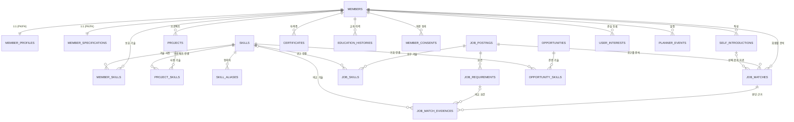
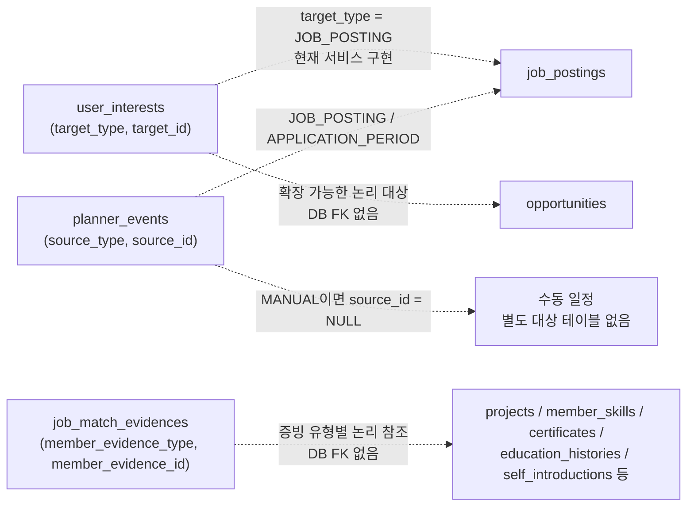

# JobPilot AI 데이터베이스 ERD 및 테이블 명세서

> 기준일: 2026-08-04  
> 대상 DBMS: MySQL (`jobpilot`)  
> 스키마 기준: Flyway 마이그레이션 `V1__core_schema.sql` ~ `V6__member_consents.sql`  
> 검증 방법: 애플리케이션은 `spring.jpa.hibernate.ddl-auto=validate`로 실행되므로, 이 문서는 **마이그레이션 DDL을 물리 스키마의 기준**으로 하고 JPA 엔터티 및 서비스 구현으로 컬럼의 사용 역할을 보완했다.

## 1. 범위와 표기법

- 물리 테이블은 총 **22개**다. 이 중 JPA `@Entity`로 직접 매핑된 테이블은 18개이고, `skill_aliases`, `job_skills`, `project_skills`, `opportunity_skills`는 현재 엔터티 클래스 없이 DB 연결 테이블로만 존재한다.
- `PK`는 기본 키, `FK`는 DB 외래 키, `UK`는 유일 제약, `IX`는 보조 인덱스다. `NN`은 `NOT NULL`, `NULL`은 null 허용을 뜻한다.
- `AUTO_INCREMENT` PK는 숫자 식별자이며, 모든 FK는 DDL에 `ON DELETE` 규칙이 없으므로 MySQL/InnoDB 기본 동작(삭제/수정 제한)을 따른다. 삭제 전 자식 레코드 정리가 필요하다.
- `JSON`과 다형 참조(`target_type + target_id` 등)는 DB가 세부 구조 또는 대상 존재를 강제하지 않는다. 애플리케이션이 일관성을 보장해야 한다.

## 2. 전체 ERD

아래 ERD는 **DDL에 실제 FK로 선언된 관계만 실선 의미로** 표현한다. `user_interests`, `planner_events`, `job_match_evidences`의 다형 참조는 3절에서 별도로 표기했다.

### 2.1 관계 요약

| 부모/참조 테이블 | 자식/연결 테이블 | 카디널리티 | 무결성 방식 | 업무 역할 |
|---|---|---:|---|---|
| `members` | `member_profiles` | 1 : 0..1 | `member_id` PK/FK | 회원의 희망 직무·근무 조건 |
| `members` | `member_specifications` | 1 : 0..1 | `member_id` PK/FK | 회원의 학력·경력 요약 |
| `members` | 자기소개서/프로젝트/기술/자격증/교육/동의 | 1 : N | 개별 `member_id` FK | 회원이 소유한 지원 증빙 데이터 |
| `skills` | 별칭·회원기술·공고기술·프로젝트기술·기회기술 | 1 : N | 각 `skill_id` FK | 기술 사전의 정규화 기준점 |
| `job_postings` | `job_requirements`, `job_skills` | 1 : N | `job_posting_id` FK | 수집 공고를 분석 가능한 요건·기술로 분해 |
| `members` + `job_postings` | `job_matches` | N : M 결과 | 두 FK + 복합 UK | 회원-공고 조합당 최신 매칭 결과 1건 |
| `job_matches` | `job_match_evidences` | 1 : N | `job_match_id` FK | 요건별 충족/갭 판단의 근거 |
| `opportunities` + `skills` | `opportunity_skills` | N : M | 복합 PK/FK | 성장 기회와 관련 기술 연결 |
| `members` | `user_interests`, `planner_events` | 1 : N | `member_id` FK | 관심 항목과 회원 개인 일정 |

### 2.2 다형 참조 및 논리 관계

다음 관계는 컬럼 값으로 대상 테이블을 구분하므로 DB FK가 없다. 대상 ID의 존재·삭제 정합성은 서비스 계층에서 관리해야 한다.

## 3. 도메인별 테이블 명세

### 3.0 테이블을 분리한 이유와 데이터 생명주기

아래 표는 컬럼 나열만으로는 드러나지 않는 설계 의도를 설명한다. **생성 주체**는 최초 행을 만드는 기능 또는 데이터 원천이고, **갱신·보존 원칙**은 해당 테이블을 왜 다른 테이블과 분리했는지와 운영 중 지켜야 할 규칙을 뜻한다. 각 테이블의 컬럼 단위 역할은 뒤의 상세 명세에서 확인한다.

| 테이블 | 테이블 역할과 분리한 이유 | 생성 주체·시점 | 갱신·보존 원칙 |
|---|---|---|---|
| `members` | 로그인 가능한 개인의 **정체성·인증 루트**다. 계정 정보와 이력서/지원 데이터의 변경 주기가 다르므로 프로필·스펙·증빙을 이 테이블에 섞지 않는다. | 회원 가입 성공 시 1건 생성 | 로그인 ID·이메일은 중복 불가다. `password_hash`는 인증 외 응답에 노출하지 않으며, 회원 삭제 시 FK 자식 데이터 처리 순서를 설계해야 한다. |
| `member_profiles` | 희망 직무, 근무 지역, 입사 가능일처럼 “현재 취업 목표”를 저장한다. 회원당 하나만 필요한 가변 프로필이라 1:1로 분리했다. | 온보딩/커리어 프로필 저장 시 생성 | 회원은 존재하지만 프로필은 아직 없을 수 있다. 저장할 때 기존 행을 갱신하며, 다중 이력 테이블로 사용하면 안 된다. |
| `member_specifications` | 학력·경력·포트폴리오의 **요약값**을 빠르게 조회·매칭하기 위한 1:1 캐시성 스펙이다. 세부 활동은 별도 증빙 테이블에 둔다. | 온보딩 또는 스펙 저장 시 생성 | 총 경력개월 등 현재 요약값을 갱신한다. 프로젝트·교육 이력을 자동 합산한다면 집계 기준을 별도 정책으로 고정해야 한다. |
| `self_introductions` | 회원이 여러 버전의 자기소개서를 유지하고, 특정 매칭이 어떤 버전을 근거로 했는지 보존한다. 본문이 길고 버전 수가 N개라 별도 테이블이다. | 회원이 자기소개서를 작성할 때 | `is_primary`는 기본 선택 편의값일 뿐 DB가 회원당 1건을 강제하지 않는다. 삭제 전 해당 문서를 참조하는 `job_matches`가 있는지 확인해야 한다. |
| `member_consents` | 약관별 동의 여부와 당시 정책 버전을 계정 정보에서 분리해 감사 가능성을 확보한다. 동의 유형은 회원마다 하나의 현재 상태만 둔다. | 가입 시 동의 유형별로 생성 | `(member_id, consent_type)` 한 행을 갱신한다. 재동의가 필요하면 `policy_version`, `agreed`, `agreed_at` 갱신 규칙 또는 별도 이력 테이블이 필요하다. |
| `email_verifications` | 회원이 되기 전의 이메일 검증 트랜잭션이다. 아직 `members`가 없을 수 있으므로 FK를 두지 않는다. | 인증코드 발송 요청 시마다 생성 | 해시만 보관하고 만료·소진·실패 횟수로 재사용을 차단한다. 인증 완료가 계정 생성 자체를 의미하지는 않는다. |
| `skills` | 회원·공고·프로젝트·기회가 같은 기술을 같은 ID로 비교하기 위한 **공통 기준 사전**이다. 문자열만 직접 저장하면 표기 차이로 매칭 품질이 깨진다. | 운영자/초기 시드 또는 기술 사전 관리 기능 | `name`은 정규명이며 유일하다. 기술 이름 변경은 모든 연결 데이터의 의미를 바꾸므로 통제된 관리 작업이어야 한다. |
| `skill_aliases` | `SpringBoot`처럼 정규명과 다른 입력 표기를 `skills` 하나로 흡수한다. 다대다 관계가 아니라 기술 1개에 여러 별칭이 붙는 정규화 보조 테이블이다. | 기술 사전 정비 시 | 별칭 하나는 하나의 정규 기술만 가리킨다. 중복 별칭을 허용하면 정규화 결과가 비결정적이므로 UK로 막는다. |
| `member_skills` | “회원이 어떤 기술을 안다”는 사실에 숙련도와 메모가 붙으므로 단순 N:M 대신 연결 엔터티로 분리했다. | 회원 스펙 입력 시 | 같은 회원·기술 조합은 1행이다. 숙련도는 자기 신고값이므로 검증된 경력 증빙과 동일시하면 안 된다. |
| `projects` | 기술 나열만으로는 증명할 수 없는 역할·문제·해결·성과를 프로젝트 단위로 보관한다. 긴 서술과 여러 프로젝트를 지원하기 위해 분리했다. | 회원이 프로젝트를 등록할 때 | 프로젝트는 회원 소유다. GitHub/배포 URL은 외부 링크이므로 접근 가능성과 실제 소유 여부를 별도 보장하지 않는다. |
| `project_skills` | 프로젝트에서 사용한 기술을 표준 기술 사전과 연결한다. 프로젝트와 기술 사이에 별도 속성이 없어 복합 PK 연결 테이블만 둔다. | 프로젝트 저장 시 연결 생성 | 동일 프로젝트·기술 중복을 허용하지 않는다. 프로젝트 삭제 전에 연결 행을 먼저 처리해야 한다. |
| `certificates` | 자격증/공식 인증을 여러 건 보관하고 매칭 근거로 사용할 수 있게 한다. 한 회원의 스펙 요약과는 다른 개별 증빙이다. | 회원이 자격증을 등록할 때 | 만료일이 있는 자격과 없는 자격을 모두 지원한다. 공식 URL은 검증 링크일 수 있으나 자동 진위 확인을 의미하지 않는다. |
| `education_histories` | 부트캠프·직업훈련·교육과정처럼 복수의 학습 이력을 관리한다. 최종 학력 요약과 별도의 활동 증빙이다. | 회원이 교육 이력을 등록할 때 | 종료일·결과 링크는 진행 중인 교육에서 비어 있을 수 있다. 학력 테이블로 오용하지 않고 과정 이력으로 해석한다. |
| `job_postings` | 외부 공급자 공고의 정규화된 현재 상태와 원문 스냅샷을 보관하는 **공고 기준 테이블**이다. 공급자 ID와 내부 ID를 분리해 다른 도메인이 안정적으로 참조한다. | 사람인 API/크롤러 수집·업서트 시 | `external_job_id`를 자연 키로 같은 공고를 갱신한다. `raw_payload`는 재처리·추적용 원본이고, 상태·마감일은 공급자 최신값으로 갱신한다. |
| `job_requirements` | 공고 한 건을 필수·우대 요건이라는 비교 가능한 원자 단위로 쪼갠다. 매칭 결과의 설명 가능성을 위해 원문 발췌와 추출 품질도 남긴다. | 공고 수집 후 요건 추출 시 | 공고가 갱신되면 기존 요건 교체/갱신 정책을 정해야 한다. `source_excerpt` 없이 요건만 남기면 AI 판정의 근거를 추적할 수 없다. |
| `job_skills` | 공고의 요구 기술을 기술 사전 ID로 연결한다. 요구 구분과 원문 근거가 관계 자체의 속성이므로 단순 문자열 배열보다 연결 테이블이 적합하다. | 공고 기술 추출 시 | 같은 공고·기술도 필수/우대가 다르면 별도 행이 가능하다. 원문 발췌는 기술 추출 정확도 검토에 사용한다. |
| `job_matches` | 회원과 공고의 N:M 조합에서 나온 최신 AI 매칭 결과다. 결과값뿐 아니라 분석 당시 스냅샷을 보관해 이후 프로필 변경에도 판단 근거를 재현한다. | 매칭 분석 실행 시 | 같은 회원·공고는 1행만 보관한다. 이는 “최신 결과” 모델이며 분석 이력 전체가 필요하면 별도 버전/실행 테이블을 추가해야 한다. |
| `job_match_evidences` | 매칭 점수만 보여주지 않고 요건별로 충족·갭 판단과 회원 측 증빙을 설명한다. 설명 가능한 추천을 위한 자식 테이블이다. | 매칭 분석 결과를 저장할 때 | 반드시 하나의 `job_match`에 속한다. 회원 증빙은 다형 참조라 대상 존재·소유자 일치를 애플리케이션에서 검증해야 한다. |
| `opportunities` | 채용공고 외에 교육·자격증·공모전 등 역량 보완 기회를 독립적으로 추천한다. 고용 공고와 일정·상태 의미가 달라 분리했다. | 운영자 또는 외부 기회 수집 기능 | 출처·외부 ID 조합으로 중복 수집을 방지한다. 현재는 `ACTIVE` 상태의 기회만 추천 조회한다. |
| `opportunity_skills` | 기회가 어떤 기술을 학습/활용하게 하는지 기술 사전에 연결한다. 사용자의 부족 기술과 교집합을 계산하기 위한 N:M 테이블이다. | 기회 등록·정비 시 | 관계에 추가 속성이 없으므로 복합 PK만 사용한다. 기술 사전에서 삭제/변경할 때 영향도를 확인해야 한다. |
| `user_interests` | 회원의 북마크를 보관하고, 관심 공고의 지원 일정 생성 트리거로 사용한다. 여러 대상 유형을 하나로 담기 위해 다형 참조를 사용한다. | 회원이 관심 토글을 켤 때 | 현재 구현의 핵심 대상은 `JOB_POSTING`이다. `target_id`는 FK가 아니므로 잘못된 대상 ID 방지와 대상 삭제 정리는 서비스 책임이다. |
| `planner_events` | 수동 일정과 관심 공고에서 파생한 자동 일정을 한 달력에서 보이게 한다. 원천 유형을 보관해 수동/자동 수정 권한을 구분한다. | 수동 일정 생성 또는 관심 공고 등록 시 | `MANUAL`은 `source_id = NULL`, `JOB_POSTING`은 공고 ID를 논리 참조한다. 자동 일정은 관심 해제 시 함께 삭제하며 사용자가 직접 수정하지 못하게 한다. |

#### 컬럼 명세를 해석하는 기준

| 표기/컬럼 패턴 | 설계상 의미와 보관 이유 |
|---|---|
| `id` | 내부 대리키(PK)다. 외부 공급자 ID나 화면 표시값이 바뀌어도 다른 테이블의 참조가 깨지지 않게 한다. |
| `*_id` + FK | 다른 테이블 행을 반드시 또는 선택적으로 가리키는 관계 키다. FK가 표시되지 않은 `*_id`는 다형 참조일 수 있으므로 별도 설명을 반드시 확인한다. |
| `*_at` | 이벤트·상태가 발생한 시각이다. 생성 시각인지, 원본 변경 시각인지, 마감 시각인지 혼용하지 않도록 컬럼을 분리했다. |
| `*_hash` | 인증 코드·비밀번호처럼 원문 재확인이 불필요한 비밀값을 복호화할 수 없게 보관하기 위한 해시다. API 응답과 로그에서 제외해야 한다. |
| `status`, `type`, `*_type` | 상태 전이 또는 분류를 위한 문자열 코드다. 대다수 DB에는 CHECK 제약이 없으므로 서비스의 enum/입력 검증이 사실상의 허용값 규칙이다. |
| `*_url` | 외부 원문·증빙·서비스로 연결하는 링크다. URL 존재는 실제 접근 가능성이나 진위까지 보증하지 않는다. |
| `raw_payload`, `profile_snapshot`, `preferred_locations` | 유연한 JSON 구조다. 변경 가능하거나 배열인 원문/스냅샷을 보관하기 위해 사용하며, 검색·관계 무결성의 주 저장 구조로 남용하지 않는다. |

### 3.1 회원 계정 및 프로필

#### `members` — 회원 계정의 루트

로그인, 식별, 인증 비밀값과 온보딩 완료 여부를 보관하는 최상위 테이블이다. 회원 소유 데이터의 기준 FK가 된다.

| 컬럼 | 타입 | NULL | 기본값 | 키/제약 | 역할 |
|---|---|:---:|---|---|---|
| `id` | BIGINT | NN | AUTO_INCREMENT | PK | 내부 회원 식별자. 다른 회원 도메인 테이블의 `member_id`가 참조한다. |
| `login_id` | VARCHAR(80) | NN | — | UK `uk_members_login_id` | 로그인에 사용하는 고유 아이디. |
| `email` | VARCHAR(255) | NN | — | UK `uk_members_email` | 계정 연락처이자 이메일 인증·중복 가입 판별 기준. |
| `password_hash` | VARCHAR(255) | NN | — | — | 평문이 아닌 비밀번호 해시. 인증 서비스만 비교에 사용해야 한다. |
| `nickname` | VARCHAR(80) | NN | — | — | 화면·응답에 표시하는 회원명. |
| `onboarding_completed` | BOOLEAN | NN | `FALSE` | V4 추가 | 취업 목표/경력 프로필 입력을 완료했는지 표시하는 상태값. |
| `created_at` | DATETIME | NN | `CURRENT_TIMESTAMP` | — | 계정 생성 시각. |
| `updated_at` | DATETIME | NN | 생성 시각, 갱신 시 자동 변경 | — | 계정 정보 최종 수정 시각. |

#### `member_profiles` — 회원의 취업 목표

`member_id` 자체가 PK와 FK를 겸하는 선택적 1:1 확장 테이블이다. 가입 직후에는 없을 수 있고, 온보딩에서 생성·갱신된다.

| 컬럼 | 타입 | NULL | 기본값 | 키/제약 | 역할 |
|---|---|:---:|---|---|---|
| `member_id` | BIGINT | NN | — | PK, FK → `members.id` | 프로필 소유 회원. 한 회원당 한 행만 허용한다. |
| `target_role` | VARCHAR(80) | NN | — | — | 사용자가 목표로 하는 세부 직무명. |
| `target_job_family` | VARCHAR(80) | NN | — | — | 목표 직군/직무군. 공고·기회 추천 필터의 기준 정보다. |
| `preferred_locations` | JSON | NULL | `NULL` | — | 선호 근무 지역 목록을 배열 등의 JSON으로 보관한다. JSON 내부 형식은 DB가 강제하지 않는다. |
| `available_from` | DATE | NULL | `NULL` | — | 입사 또는 근무 시작 가능일. |
| `experience_type` | VARCHAR(30) | NN | `'ENTRY'` | — | 신입/경력 등 지원자 경력 구분. 현재 요청값은 대문자화해 저장한다. |
| `github_username` | VARCHAR(100) | NULL | `NULL` | — | GitHub 분석 연계에 쓰는 사용자명. |

#### `member_specifications` — 회원 스펙 요약

이력의 빠른 비교를 위한 1:1 요약 테이블이다. 세부 교육·자격증·프로젝트는 별도 1:N 테이블에 둔다.

| 컬럼 | 타입 | NULL | 기본값 | 키/제약 | 역할 |
|---|---|:---:|---|---|---|
| `member_id` | BIGINT | NN | — | PK, FK → `members.id` | 스펙 소유 회원. 한 회원당 한 행이다. |
| `education_level` | VARCHAR(50) | NULL | `NULL` | — | 최종 학력 수준 요약. |
| `school_name` | VARCHAR(255) | NULL | `NULL` | — | 대표 학교명. |
| `major` | VARCHAR(255) | NULL | `NULL` | — | 전공명. |
| `graduation_status` | VARCHAR(30) | NULL | `NULL` | — | 졸업/재학/수료 등의 학력 상태. |
| `total_career_months` | INT | NN | `0` | — | 총 실무 경력 개월 수. |
| `technical_summary` | TEXT | NULL | `NULL` | — | 기술 경험을 매칭/AI 분석에 전달할 수 있는 자유 서술 요약. |
| `portfolio_url` | VARCHAR(1000) | NULL | `NULL` | — | 포트폴리오 외부 주소. |
| `updated_at` | DATETIME | NN | 생성 시각, 갱신 시 자동 변경 | — | 스펙 요약의 최종 변경 시각. |

#### `self_introductions` — 자기소개서 버전

회원이 여러 개의 자기소개서를 보관하고 특정 공고 매칭에 선택적으로 연결할 수 있게 한다.

| 컬럼 | 타입 | NULL | 기본값 | 키/제약 | 역할 |
|---|---|:---:|---|---|---|
| `id` | BIGINT | NN | AUTO_INCREMENT | PK | 자기소개서 식별자. |
| `member_id` | BIGINT | NN | — | FK → `members.id`, IX `ix_self_introductions_member` | 작성 회원. 회원별 목록 조회의 기준이다. |
| `title` | VARCHAR(255) | NN | — | — | 자기소개서 버전을 식별하는 제목. |
| `content` | MEDIUMTEXT | NN | — | — | 자기소개서 본문. |
| `is_primary` | BOOLEAN | NN | `FALSE` | — | 기본으로 사용할 자기소개서 여부. DB에는 회원당 1건만 보장하는 제약은 없다. |
| `created_at` | DATETIME | NN | `CURRENT_TIMESTAMP` | — | 작성 시각. |
| `updated_at` | DATETIME | NN | 생성 시각, 갱신 시 자동 변경 | — | 최종 수정 시각. |

#### `member_consents` — 약관 동의 이력의 현재 상태

회원·동의 유형별로 한 행을 보관한다. 회원 생성 시 이용약관, 개인정보 수집, 마케팅 이메일 3개 유형을 생성한다.

| 컬럼 | 타입 | NULL | 기본값 | 키/제약 | 역할 |
|---|---|:---:|---|---|---|
| `id` | BIGINT | NN | AUTO_INCREMENT | PK | 동의 레코드 식별자. |
| `member_id` | BIGINT | NN | — | FK → `members.id`, IX `ix_member_consents_member` | 동의 주체 회원. JPA에서는 `Member` 다대일 연관으로 매핑된다. |
| `consent_type` | VARCHAR(50) | NN | — | UK 일부 | 동의 항목. 코드 enum: `TERMS_OF_SERVICE`, `PRIVACY_COLLECTION`, `MARKETING_EMAIL`. |
| `policy_version` | VARCHAR(30) | NN | — | — | 동의한 약관/정책 버전. 정책 변경 시 재동의 여부 판단에 사용한다. |
| `agreed` | BOOLEAN | NN | — | — | 해당 정책에 동의했는지 여부. |
| `agreed_at` | DATETIME | NULL | `NULL` | — | 동의한 순간. 미동의 행에서는 null일 수 있다. |
| `created_at` | DATETIME | NN | `CURRENT_TIMESTAMP` | — | 동의 상태 행 생성 시각. |

제약: `uk_member_consents_member_type (member_id, consent_type)` — 같은 회원·동의유형의 중복 행을 금지한다.

#### `email_verifications` — 회원 가입 전 이메일 인증 요청

계정과 FK로 연결하지 않는 인증 트랜잭션 테이블이다. 이메일별 다수의 인증 요청 이력을 보관하며, 가입 완료 시 `members`와 직접 결합하지 않는다.

| 컬럼 | 타입 | NULL | 기본값 | 키/제약 | 역할 |
|---|---|:---:|---|---|---|
| `id` | BIGINT | NN | AUTO_INCREMENT | PK | 이메일 인증 요청 식별자. |
| `email` | VARCHAR(255) | NN | — | IX `ix_email_verifications_email_created` | 인증 대상 이메일. 최근 요청 조회와 재발송 제한 기준이다. |
| `code_hash` | VARCHAR(255) | NN | — | — | 발송한 인증 코드의 해시. 평문 코드는 저장하지 않는다. |
| `verification_token_hash` | VARCHAR(255) | NULL | `NULL` | — | 코드 검증 후 발급한 가입용 토큰의 해시. |
| `expires_at` | DATETIME | NN | — | — | 코드/인증 흐름 유효 종료 시각. |
| `verified_at` | DATETIME | NULL | `NULL` | — | 코드가 성공적으로 검증된 시각. |
| `consumed_at` | DATETIME | NULL | `NULL` | — | 검증 토큰을 가입에 사용해 소진한 시각. 재사용 방지에 쓴다. |
| `failed_attempts` | INT | NN | `0` | — | 인증 코드 불일치 누적 횟수. 최대 실패 횟수 정책과 비교한다. |
| `created_at` | DATETIME | NN | `CURRENT_TIMESTAMP` | — | 인증 요청 생성 시각. |

### 3.2 기술 사전 및 회원 경력 증빙

#### `skills` — 정규화된 기술 사전

회원, 공고, 프로젝트, 성장기회가 공통으로 참조하는 기술의 정규 명칭이다. 이름 자체의 중복을 허용하지 않는다.

| 컬럼 | 타입 | NULL | 기본값 | 키/제약 | 역할 |
|---|---|:---:|---|---|---|
| `id` | BIGINT | NN | AUTO_INCREMENT | PK | 기술 식별자. 여러 연결 테이블이 참조한다. |
| `name` | VARCHAR(100) | NN | — | UK `uk_skills_name` | 비교 기준이 되는 정규 기술명(예: `Spring Boot`). |
| `category` | VARCHAR(30) | NN | — | — | 언어, 프레임워크, DB 등 기술 분류. |

#### `skill_aliases` — 기술명 동의어 사전

JPA 엔터티 없이 운영되는 보조 테이블이다. 다양한 표기를 하나의 `skills` 행으로 정규화하기 위한 사전이다.

| 컬럼 | 타입 | NULL | 기본값 | 키/제약 | 역할 |
|---|---|:---:|---|---|---|
| `id` | BIGINT | NN | AUTO_INCREMENT | PK | 별칭 식별자. |
| `skill_id` | BIGINT | NN | — | FK → `skills.id` | 별칭이 가리키는 정규 기술. |
| `alias` | VARCHAR(100) | NN | — | UK `uk_skill_aliases_alias` | 유일한 대체 표기(예: `SpringBoot`). |

#### `member_skills` — 회원 보유 기술

회원과 정규 기술의 N:M 관계에 숙련도·메모라는 관계 속성을 추가한 연결 엔터티다.

| 컬럼 | 타입 | NULL | 기본값 | 키/제약 | 역할 |
|---|---|:---:|---|---|---|
| `id` | BIGINT | NN | AUTO_INCREMENT | PK | 회원 기술 행 식별자. |
| `member_id` | BIGINT | NN | — | FK → `members.id` | 기술 보유 회원. |
| `skill_id` | BIGINT | NN | — | FK → `skills.id` | 보유하는 정규 기술. |
| `self_reported_level` | VARCHAR(20) | NULL | `NULL` | — | 사용자가 직접 입력한 숙련도. |
| `note` | VARCHAR(500) | NULL | `NULL` | — | 사용 기간·프로젝트 맥락 등의 기술 메모. |

제약: `uk_member_skills_member_skill (member_id, skill_id)` — 같은 회원에게 같은 기술을 두 번 등록할 수 없다.

#### `projects` — 회원 프로젝트 경험

프로젝트 단위의 문제 해결 경험을 보관한다. 사용하는 기술은 `project_skills`로 분리해 여러 기술과 연결한다.

| 컬럼 | 타입 | NULL | 기본값 | 키/제약 | 역할 |
|---|---|:---:|---|---|---|
| `id` | BIGINT | NN | AUTO_INCREMENT | PK | 프로젝트 식별자. |
| `member_id` | BIGINT | NN | — | FK → `members.id`, IX `ix_projects_member` | 프로젝트 소유 회원. |
| `title` | VARCHAR(255) | NN | — | — | 프로젝트명. |
| `role_description` | TEXT | NULL | `NULL` | — | 팀 내 담당 역할과 기여도. |
| `problem_description` | TEXT | NULL | `NULL` | — | 해결하려던 문제/요구 사항. |
| `solution_description` | TEXT | NULL | `NULL` | — | 구현한 해결 방식·기술적 접근. |
| `result_description` | TEXT | NULL | `NULL` | — | 성과, 결과, 배운 점. |
| `github_url` | VARCHAR(1000) | NULL | `NULL` | — | 소스 저장소 URL. |
| `deployment_url` | VARCHAR(1000) | NULL | `NULL` | — | 배포 서비스 URL. |
| `started_at` | DATE | NULL | `NULL` | — | 프로젝트 시작일. |
| `ended_at` | DATE | NULL | `NULL` | — | 프로젝트 종료일. 진행 중이면 null 허용. |

#### `project_skills` — 프로젝트 사용 기술 연결

JPA 엔터티 없이 운영되는 복합 PK 연결 테이블이다. 프로젝트에 사용한 기술만 저장하며 별도 속성은 없다.

| 컬럼 | 타입 | NULL | 기본값 | 키/제약 | 역할 |
|---|---|:---:|---|---|---|
| `project_id` | BIGINT | NN | — | PK, FK → `projects.id` | 기술을 사용한 프로젝트. |
| `skill_id` | BIGINT | NN | — | PK, FK → `skills.id` | 프로젝트에서 사용한 정규 기술. |

복합 PK: `(project_id, skill_id)` — 같은 프로젝트의 같은 기술 중복 연결을 막는다.

#### `certificates` — 자격증 및 공식 인증

회원의 자격증, 공식 인증 정보를 보관한다. 매칭 근거의 대상이 될 수 있다.

| 컬럼 | 타입 | NULL | 기본값 | 키/제약 | 역할 |
|---|---|:---:|---|---|---|
| `id` | BIGINT | NN | AUTO_INCREMENT | PK | 자격증 식별자. |
| `member_id` | BIGINT | NN | — | FK → `members.id`, IX `ix_certificates_member` | 보유 회원. |
| `name` | VARCHAR(255) | NN | — | — | 자격증/인증 명칭. |
| `issuer` | VARCHAR(255) | NULL | `NULL` | — | 발급 기관. |
| `acquired_at` | DATE | NULL | `NULL` | — | 취득일. |
| `expires_at` | DATE | NULL | `NULL` | — | 만료일. 영구 자격은 null일 수 있다. |
| `official_url` | VARCHAR(1000) | NULL | `NULL` | — | 검증 가능한 공식 페이지 또는 증빙 URL. |

#### `education_histories` — 교육·훈련 이력

정규교육 외 부트캠프·직업훈련 등 다수의 학습 이력을 보관한다.

| 컬럼 | 타입 | NULL | 기본값 | 키/제약 | 역할 |
|---|---|:---:|---|---|---|
| `id` | BIGINT | NN | AUTO_INCREMENT | PK | 교육 이력 식별자. |
| `member_id` | BIGINT | NN | — | FK → `members.id`, IX `ix_education_histories_member` | 이력 소유 회원. |
| `title` | VARCHAR(255) | NN | — | — | 과정/교육명. |
| `provider` | VARCHAR(255) | NULL | `NULL` | — | 교육 기관·제공자. |
| `started_at` | DATE | NULL | `NULL` | — | 교육 시작일. |
| `ended_at` | DATE | NULL | `NULL` | — | 교육 종료일. 진행 중이면 null 허용. |
| `result_url` | VARCHAR(1000) | NULL | `NULL` | — | 수료증·성과물 등 결과 링크. |

### 3.3 채용공고 수집 및 요구사항

#### `job_postings` — 외부 채용공고의 정규 저장소

사람인(Saramin)에서 수집한 채용공고를 외부 공고 ID 기준으로 업서트한다. 원문, 수집 시점, 크롤링 상태를 함께 보관해 목록·상세·매칭의 기준으로 사용한다.

| 컬럼 | 타입 | NULL | 기본값 | 키/제약 | 역할 |
|---|---|:---:|---|---|---|
| `id` | BIGINT | NN | AUTO_INCREMENT | PK | 내부 공고 식별자. 다른 도메인의 참조 기준이다. |
| `external_job_id` | VARCHAR(150) | NN | — | UK `uk_job_postings_external_job_id` | 공급자(사람인)의 공고 식별자. 수집 업서트의 자연 키다. |
| `title` | VARCHAR(500) | NN | — | IX 일부 | 채용공고 제목. |
| `company_name` | VARCHAR(255) | NULL | `NULL` | IX 일부 | 채용 회사명. |
| `company_url` | VARCHAR(1500) | NULL | `NULL` | — | 공급자 제공 회사 상세 URL. |
| `description` | MEDIUMTEXT | NULL | `NULL` | — | 공고 상세 본문. |
| `source_url` | VARCHAR(1500) | NN | — | — | 실제 지원/원문 공고 URL. |
| `location` | VARCHAR(255) | NULL | `NULL` | — | 근무 지역. |
| `employment_type` | VARCHAR(50) | NULL | `NULL` | — | 정규직/계약직 등 고용 형태. |
| `experience_type` | VARCHAR(50) | NULL | `NULL` | — | 신입/경력 등 공고의 경력 조건. |
| `industry_code` | VARCHAR(100) | NULL | `NULL` | — | 공급자 산업 분류 코드. |
| `industry_name` | VARCHAR(255) | NULL | `NULL` | — | 공급자 산업 분류명. |
| `job_mid_code` | VARCHAR(100) | NULL | `NULL` | — | 공급자 중분류 직무 코드. |
| `job_mid_name` | VARCHAR(255) | NULL | `NULL` | — | 공급자 중분류 직무명. |
| `job_code` | VARCHAR(500) | NULL | `NULL` | — | 공급자 세부 직무 코드(복수 표현 가능). |
| `job_name` | VARCHAR(1000) | NULL | `NULL` | — | 공급자 세부 직무명(복수 표현 가능). |
| `salary` | VARCHAR(255) | NULL | `NULL` | — | 공고에 표시된 급여 조건 원문. |
| `keywords` | TEXT | NULL | `NULL` | — | 공고 검색/분석에 활용할 키워드 원문. |
| `published_at` | DATETIME | NULL | `NULL` | — | 원문 공고 게시 시각. |
| `deadline_at` | DATETIME | NULL | `NULL` | IX 일부 | 지원 마감 시각. |
| `is_rolling_deadline` | BOOLEAN | NN | `FALSE` | — | 상시채용 여부. `deadline_at` 해석 시 함께 사용한다. |
| `status` | VARCHAR(30) | NN | `'UNKNOWN'` | IX 일부 | 공고 상태. 수집 서비스는 종료 공고를 `CLOSED`로 갱신한다. |
| `fetched_at` | DATETIME | NN | `CURRENT_TIMESTAMP` | — | 공급자 API에서 마지막으로 수집한 시각. |
| `source_updated_at` | DATETIME | NULL | `NULL` | — | 공급자 데이터의 최종 변경 시각. 변경 비교·업서트 판단에 쓴다. |
| `crawl_status` | VARCHAR(30) | NN | `'NOT_REQUESTED'` | — | 원문 크롤링 상태. 기본값은 미요청이다. |
| `crawled_at` | DATETIME | NULL | `NULL` | — | 원문 크롤링 처리 시각. |
| `raw_payload` | JSON | NULL | `NULL` | — | 공급자 응답 원본. 정규화 규칙 변경 시 추적·재처리에 사용한다. |

인덱스:

- `ix_job_postings_status_deadline (status, deadline_at)`: 상태별 마감 순 조회에 사용한다.
- `ix_job_postings_company_title (company_name, title)`: 회사명·공고명 기반 탐색 또는 중복 점검을 보조한다.

#### `job_requirements` — 공고 자격·우대 요건

공고 본문을 분석 가능한 최소 요건으로 분해한 테이블이다. 추출 출처와 검증 상태를 남겨 AI 판단 근거의 신뢰도를 구분한다.

| 컬럼 | 타입 | NULL | 기본값 | 키/제약 | 역할 |
|---|---|:---:|---|---|---|
| `id` | BIGINT | NN | AUTO_INCREMENT | PK | 공고 요건 식별자. |
| `job_posting_id` | BIGINT | NN | — | FK → `job_postings.id`, IX `ix_job_requirements_posting_type` | 이 요건이 속한 공고. |
| `type` | VARCHAR(20) | NN | — | IX 일부 | 요건 구분. 문서·구현에서 `REQUIRED`, `PREFERRED`를 사용한다. |
| `content` | TEXT | NN | — | — | 정규화한 요건 내용. |
| `source_excerpt` | TEXT | NN | — | — | 요건을 추출한 원문 발췌. 판단의 추적 근거다. |
| `importance` | VARCHAR(20) | NN | `'MEDIUM'` | — | 요건 중요도. |
| `extraction_source` | VARCHAR(30) | NN | `'SARAMIN_API'` | — | 요건 획득 경로. 문서·구현에서 `SARAMIN_API`, `SARAMIN_CRAWL`을 사용한다. |
| `verification_status` | VARCHAR(30) | NN | `'VERIFIED'` | — | 추출 결과 신뢰 상태. 문서·구현에서 `VERIFIED`, `NEEDS_REVIEW`를 사용한다. |

#### `job_skills` — 공고 요구 기술 연결

JPA 엔터티 없는 복합 PK 연결 테이블이다. 공고가 요구하는 기술과 필수/우대 여부를 기술 사전과 연결한다.

| 컬럼 | 타입 | NULL | 기본값 | 키/제약 | 역할 |
|---|---|:---:|---|---|---|
| `job_posting_id` | BIGINT | NN | — | PK, FK → `job_postings.id` | 요구 기술을 가진 공고. |
| `skill_id` | BIGINT | NN | — | PK, FK → `skills.id` | 정규화된 요구 기술. |
| `requirement_type` | VARCHAR(20) | NN | PK | 기술의 필수/우대 구분. 동일 기술도 구분별로 한 행씩 둘 수 있다. |
| `source_excerpt` | TEXT | NN | — | — | 해당 기술이 언급된 공고 원문 발췌. |

복합 PK: `(job_posting_id, skill_id, requirement_type)`.

### 3.4 AI 매칭 결과

#### `job_matches` — 회원-공고 매칭 결과

특정 회원과 특정 공고를 비교한 최신 분석 결과를 한 행에 저장한다. 회원과 공고의 N:M 관계를 결과 엔터티로 해소하며, 같은 조합은 한 건만 둔다.

| 컬럼 | 타입 | NULL | 기본값 | 키/제약 | 역할 |
|---|---|:---:|---|---|---|
| `id` | BIGINT | NN | AUTO_INCREMENT | PK | 매칭 결과 식별자. |
| `member_id` | BIGINT | NN | — | FK → `members.id`, UK/IX 일부 | 분석 대상 회원. |
| `job_posting_id` | BIGINT | NN | — | FK → `job_postings.id`, UK 일부 | 분석 대상 공고. |
| `self_introduction_id` | BIGINT | NULL | `NULL` | FK → `self_introductions.id` | 분석에 반영한 자기소개서. 사용하지 않은 경우 null이다. |
| `recommendation_level` | VARCHAR(40) | NN | — | IX 일부 | 추천 등급. JPA enum: `APPLY_NOW`, `CHALLENGE_AFTER_GAPS`, `DIFFICULT_NOW`. |
| `readiness_score` | DECIMAL(5,2) | NN | — | IX 일부 | 지원 준비도 점수. 정수부 3자리·소수부 2자리까지 저장한다. |
| `summary_comment` | TEXT | NULL | `NULL` | — | 매칭 결과의 종합 설명. |
| `missing_required_count` | INT | NN | `0` | — | 미충족 필수 요건의 개수. 추천 등급 산정 근거다. |
| `ai_model` | VARCHAR(100) | NULL | `NULL` | — | 분석에 사용한 AI 모델 식별자. 재현성과 품질 추적에 사용한다. |
| `profile_snapshot` | JSON | NULL | `NULL` | — | 분석 당시의 회원 스펙 스냅샷. 이후 프로필 변경과 무관하게 분석 근거를 보존한다. |
| `analyzed_at` | DATETIME | NN | `CURRENT_TIMESTAMP` | — | 분석 생성/갱신 시점. |

제약 및 인덱스:

- `uk_job_matches_member_job (member_id, job_posting_id)`: 회원-공고 조합당 결과 1건을 강제한다.
- `ix_job_matches_member_level_score (member_id, recommendation_level, readiness_score)`: 회원의 추천 등급별 결과를 준비도 높은 순으로 조회하는 데 사용한다.

#### `job_match_evidences` — 매칭 판정 근거

`job_matches`의 결과가 나온 이유를 요건 또는 기술 단위로 저장한다. 회원 쪽 증빙은 여러 테이블을 가리킬 수 있으므로 다형 참조를 사용한다.

| 컬럼 | 타입 | NULL | 기본값 | 키/제약 | 역할 |
|---|---|:---:|---|---|---|
| `id` | BIGINT | NN | AUTO_INCREMENT | PK | 근거 레코드 식별자. |
| `job_match_id` | BIGINT | NN | — | FK → `job_matches.id`, IX `ix_job_match_evidences_match` | 이 근거가 설명하는 매칭 결과. |
| `job_requirement_id` | BIGINT | NULL | `NULL` | FK → `job_requirements.id` | 비교한 공고 요건. 기술 단위 판단만 있으면 null일 수 있다. |
| `skill_id` | BIGINT | NULL | `NULL` | FK → `skills.id` | 비교한 정규 기술. 일반 요건 판단만 있으면 null일 수 있다. |
| `member_evidence_type` | VARCHAR(30) | NN | — | — | 회원 측 증빙의 종류를 나타내는 다형 참조 구분자. |
| `member_evidence_id` | BIGINT | NULL | `NULL` | 논리 참조, DB FK 없음 | `member_evidence_type`이 지정한 회원 증빙 행의 ID. |
| `status` | VARCHAR(30) | NN | — | — | 해당 요건/기술의 충족·부분충족·미충족 등 판정 상태. DB CHECK나 enum은 없다. |
| `comment` | TEXT | NULL | `NULL` | — | 판정 사유를 사람이 읽을 수 있게 설명한 문구. |
| `gap_action` | TEXT | NULL | `NULL` | — | 부족한 경우 보완을 위해 제안하는 행동. |

주의: `member_evidence_type`과 `member_evidence_id` 조합은 `projects`, `member_skills`, `certificates`, `education_histories`, `self_introductions` 등 여러 회원 증빙을 가리키도록 설계됐지만 물리 FK가 없다. 사용 가능한 유형 목록과 소유 회원 일치 여부를 서비스/검증 로직으로 강제해야 한다.

### 3.5 성장 기회, 관심, 일정

#### `opportunities` — 성장 기회 정보

교육, 자격증, 공모전, 챌린지 등 공고 외 성장 기회를 수집·추천하기 위한 독립 테이블이다.

| 컬럼 | 타입 | NULL | 기본값 | 키/제약 | 역할 |
|---|---|:---:|---|---|---|
| `id` | BIGINT | NN | AUTO_INCREMENT | PK | 성장 기회 식별자. |
| `type` | VARCHAR(30) | NN | — | IX 일부 | 기회 유형(교육/자격/공모전 등). DB는 허용값을 제한하지 않는다. |
| `source_name` | VARCHAR(100) | NN | — | UK 일부 | 수집 출처명. |
| `external_id` | VARCHAR(150) | NULL | `NULL` | UK 일부 | 출처가 제공하는 외부 식별자. |
| `title` | VARCHAR(500) | NN | — | — | 기회 제목. |
| `organization` | VARCHAR(255) | NULL | `NULL` | — | 주최·운영 기관. |
| `description` | TEXT | NULL | `NULL` | — | 기회 상세 설명. |
| `source_url` | VARCHAR(1500) | NN | — | — | 원문 또는 신청 페이지 URL. |
| `application_start_at` | DATETIME | NULL | `NULL` | — | 신청 시작 시각. |
| `deadline_at` | DATETIME | NULL | `NULL` | IX 일부 | 신청 마감 시각. |
| `event_start_at` | DATETIME | NULL | `NULL` | — | 프로그램/행사 시작 시각. |
| `event_end_at` | DATETIME | NULL | `NULL` | — | 프로그램/행사 종료 시각. |
| `status` | VARCHAR(30) | NN | `'ACTIVE'` | — | 기회 노출 상태. 현재 조회는 `ACTIVE` 상태를 사용한다. |

제약 및 인덱스:

- `uk_opportunities_source_external (source_name, external_id)`: 같은 출처의 외부 기회 중복 수집을 방지한다. MySQL의 복합 UK는 `external_id`가 null인 여러 행을 허용할 수 있다.
- `ix_opportunities_type_deadline (type, deadline_at)`: 유형별 마감 임박 기회 조회에 사용한다.

#### `opportunity_skills` — 성장 기회 관련 기술 연결

JPA 엔터티 없이 운영되는 복합 PK 연결 테이블이다. 추천 시 사용자의 부족 기술과 기회 기술의 교집합을 계산할 수 있게 한다.

| 컬럼 | 타입 | NULL | 기본값 | 키/제약 | 역할 |
|---|---|:---:|---|---|---|
| `opportunity_id` | BIGINT | NN | — | PK, FK → `opportunities.id` | 관련 기술을 요구/학습시키는 기회. |
| `skill_id` | BIGINT | NN | — | PK, FK → `skills.id` | 기회와 연관된 정규 기술. |

복합 PK: `(opportunity_id, skill_id)`.

#### `user_interests` — 회원 관심(북마크)

회원이 공고 등의 대상을 북마크한 사실을 보관한다. 대상은 `target_type`으로 해석하므로 `target_id`에 DB FK를 둘 수 없는 다형 구조다.

| 컬럼 | 타입 | NULL | 기본값 | 키/제약 | 역할 |
|---|---|:---:|---|---|---|
| `id` | BIGINT | NN | AUTO_INCREMENT | PK | 관심 레코드 식별자. |
| `member_id` | BIGINT | NN | — | FK → `members.id`, IX `ix_user_interests_member` | 관심을 등록한 회원. |
| `target_type` | VARCHAR(30) | NN | — | UK 일부 | `target_id`가 가리키는 도메인 유형. 현재 서비스의 공고 처리 값은 `JOB_POSTING`이다. |
| `target_id` | BIGINT | NN | — | UK 일부, 논리 참조 | `target_type`에 따라 해석하는 대상 행 ID. 현재 `JOB_POSTING`이면 `job_postings.id`다. |
| `created_at` | DATETIME | NN | `CURRENT_TIMESTAMP` | — | 북마크한 시각. |

제약: `uk_user_interests_member_target (member_id, target_type, target_id)` — 같은 회원이 같은 대상을 중복 관심 등록할 수 없다.

#### `planner_events` — 회원 일정

수동 일정과 관심 공고에서 파생한 지원 기간 일정을 한 테이블에 관리한다. V2에서 수동 일정 지원을 위해 `source_id`를 null 허용으로 변경했다.

| 컬럼 | 타입 | NULL | 기본값 | 키/제약 | 역할 |
|---|---|:---:|---|---|---|
| `id` | BIGINT | NN | AUTO_INCREMENT | PK | 일정 식별자. |
| `member_id` | BIGINT | NN | — | FK → `members.id`, IX `ix_planner_events_member_starts` | 일정을 소유한 회원. |
| `source_type` | VARCHAR(30) | NN | — | UK 일부 | 일정 생성 원천. 현재 구현은 수동 일정 `MANUAL`, 관심 공고 `JOB_POSTING`을 사용한다. |
| `source_id` | BIGINT | NULL | `NULL` | UK 일부, 논리 참조 | 원천 행의 ID. `MANUAL` 수동 일정은 null이고, `JOB_POSTING`은 공고 ID다. |
| `event_type` | VARCHAR(30) | NN | — | UK 일부 | 일정 종류. 관심 공고 자동 생성은 `APPLICATION_PERIOD`; 수동 일정은 요청값을 정규화해 보관한다. |
| `title` | VARCHAR(500) | NN | — | — | 달력에 표시할 일정 제목. |
| `starts_at` | DATETIME | NN | — | IX 일부 | 일정 시작 시각. |
| `ends_at` | DATETIME | NULL | `NULL` | — | 일정 종료 시각. 없으면 단일 시점/미정 일정이다. |
| `all_day` | BOOLEAN | NN | `TRUE` | — | 종일 일정 여부. |
| `created_at` | DATETIME | NN | `CURRENT_TIMESTAMP` | — | 일정 생성 시각. |

제약 및 인덱스:

- `uk_planner_events_member_source_type (member_id, source_type, source_id, event_type)`: 같은 회원의 동일 원천·일정 유형 중복 생성을 방지한다. `source_id`가 null인 MySQL 복합 UK의 특성상 수동 일정 중복까지는 강제하지 않는다.
- `ix_planner_events_member_starts (member_id, starts_at)`: 회원별 기간 일정 조회에 사용한다.

### 3.6 키·인덱스·무결성 점검표

#### 물리 FK 목록

| 자식 테이블.컬럼 | 부모 테이블.컬럼 | 용도 |
|---|---|---|
| `member_profiles.member_id` | `members.id` | 1:1 목표 프로필 |
| `member_specifications.member_id` | `members.id` | 1:1 스펙 요약 |
| `self_introductions.member_id` | `members.id` | 회원 자기소개서 |
| `member_skills.member_id` | `members.id` | 회원 보유 기술 |
| `member_skills.skill_id` | `skills.id` | 정규 기술 참조 |
| `projects.member_id` | `members.id` | 회원 프로젝트 |
| `project_skills.project_id` | `projects.id` | 프로젝트 기술 연결 |
| `project_skills.skill_id` | `skills.id` | 정규 기술 참조 |
| `certificates.member_id` | `members.id` | 회원 자격증 |
| `education_histories.member_id` | `members.id` | 회원 교육 이력 |
| `member_consents.member_id` | `members.id` | 회원 동의 상태 |
| `skill_aliases.skill_id` | `skills.id` | 기술 동의어 |
| `job_requirements.job_posting_id` | `job_postings.id` | 공고 요건 |
| `job_skills.job_posting_id` | `job_postings.id` | 공고 요구 기술 |
| `job_skills.skill_id` | `skills.id` | 정규 기술 참조 |
| `job_matches.member_id` | `members.id` | 매칭 대상 회원 |
| `job_matches.job_posting_id` | `job_postings.id` | 매칭 대상 공고 |
| `job_matches.self_introduction_id` | `self_introductions.id` | 선택 자기소개서 |
| `job_match_evidences.job_match_id` | `job_matches.id` | 매칭 판단 근거 |
| `job_match_evidences.job_requirement_id` | `job_requirements.id` | 비교 공고 요건 |
| `job_match_evidences.skill_id` | `skills.id` | 비교 기술 |
| `opportunity_skills.opportunity_id` | `opportunities.id` | 기회 기술 연결 |
| `opportunity_skills.skill_id` | `skills.id` | 정규 기술 참조 |
| `user_interests.member_id` | `members.id` | 회원 관심 등록 |
| `planner_events.member_id` | `members.id` | 회원 일정 |

#### DB가 직접 보장하지 않는 핵심 규칙

| 규칙 | 현재 구조 | 운영 시 확인할 책임 |
|---|---|---|
| 기본 자기소개서는 회원당 최대 1개 | `is_primary`에 UK가 없음 | 저장 서비스에서 기존 기본본 해제 또는 부분 유니크 인덱스 설계 검토 |
| 관심 대상의 존재 | `user_interests.target_type/target_id`는 FK 없음 | 관심 등록·삭제 시 유형별 대상 존재 여부 확인 |
| 일정 원천의 존재 | `planner_events.source_type/source_id`는 FK 없음 | 자동 일정 생성·관심 해제 시 함께 생성/삭제 |
| 매칭 증빙의 대상·소유자 일치 | `member_evidence_type/member_evidence_id`는 FK 없음 | 증빙 타입별 ID 존재와 `member_id` 일치 검증 |
| 문자열 상태값의 허용 범위 | 대다수 `VARCHAR`, DB CHECK 없음 | enum/상수/입력 검증으로 일관성 유지 |
| 스냅샷 JSON의 형태 | `preferred_locations`, `raw_payload`, `profile_snapshot`은 자유 JSON | DTO/서비스에서 JSON 스키마와 개인정보 노출 범위 관리 |

## 4. 마이그레이션 이력

| 버전 | 스키마 변경 | 명세 반영 |
|---|---|---|
| V1 | 회원·기술·공고·매칭·기회·관심·일정의 핵심 20개 테이블 생성 | 3.1~3.5의 기본 구조 |
| V2 | `planner_events.source_id`를 null 허용으로 변경 | 수동 일정의 `MANUAL` + `source_id = NULL` 반영 |
| V3 | 기존 관심 공고를 지원 기간 일정으로 백필 | 데이터 이행만 수행, 컬럼 변경 없음 |
| V4 | `members.onboarding_completed` 추가 | 회원 온보딩 상태 반영 |
| V5 | `email_verifications` 생성 | 가입 전 이메일 인증 상태 반영 |
| V6 | `member_consents` 생성 | 회원 약관 동의 상태 반영 |

## 5. 엔터티 매핑 현황

| 구분 | 테이블 |
|---|---|
| JPA 엔터티 매핑 | `members`, `member_profiles`, `member_specifications`, `self_introductions`, `skills`, `member_skills`, `projects`, `certificates`, `education_histories`, `member_consents`, `email_verifications`, `job_postings`, `job_requirements`, `job_matches`, `job_match_evidences`, `opportunities`, `user_interests`, `planner_events` |
| DB 연결 테이블만 존재 | `skill_aliases`, `job_skills`, `project_skills`, `opportunity_skills` |

`member_consents`만 객체 연관관계(`Member` 다대일)를 사용하고, 나머지 엔터티의 FK는 대부분 `Long ...Id` 스칼라 컬럼으로 매핑한다. DB FK의 존재 여부와 JPA 객체 연관관계 유무는 별개임에 유의한다.
