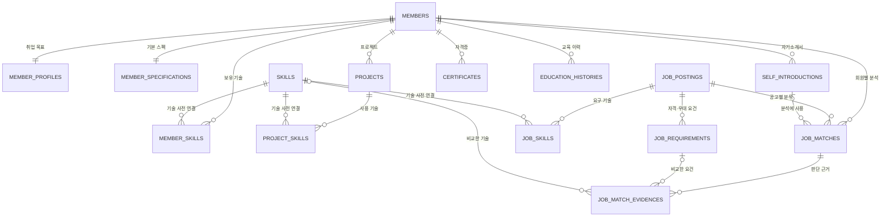

# JobPilot AI 엔터티 설계서

## 1. 문서 목적

이 문서는 JobPilot AI의 데이터 엔터티 구조만 설명한다. API, 화면, 크롤러 및 AI 프롬프트의 구현 설명은 포함하지 않는다.

현재 채용정보 공급자는 **사람인(Saramin) 하나만 사용**한다. 회원이 입력한 스펙·기술·프로젝트·자기소개서와 사람인 IT 채용공고의 자격요건을 비교하여 지원 가능성을 저장하는 구조다.

- 데이터베이스명: `jobpilot`
- DBMS: MySQL
- 스키마 정의: `backend/src/main/resources/db/migration/V1__core_schema.sql`
- 현재 Java JPA 엔터티: 16개
- 엔터티가 없는 연결·보조 테이블: 4개

## 2. 전체 관계도



핵심 흐름은 다음과 같다.

```text
회원 정보 + 회원 증빙 자료
        ↓
사람인 채용공고 + 공고 자격요건
        ↓
AI 비교 분석
        ↓
추천 결과(JobMatch) + 항목별 근거(JobMatchEvidence)
```

## 3. 회원 영역

### 3.1 Member (`members`)

회원 계정의 기준 엔터티다. 다른 모든 회원 데이터는 `member_id`를 통해 이 엔터티에 귀속된다.

| 필드 | DB 컬럼 | 타입 | 필수 | 설명 |
|---|---|---:|:---:|---|
| id | id | BIGINT | O | 회원 PK, 자동 증가 |
| loginId | login_id | VARCHAR(80) | O | 로그인 아이디, 유일값 |
| email | email | VARCHAR(255) | O | 이메일, 유일값 |
| passwordHash | password_hash | VARCHAR(255) | O | 암호화된 비밀번호 |
| nickname | nickname | VARCHAR(80) | O | 화면 표시 이름 |
| createdAt | created_at | DATETIME | O | 가입 시각 |
| updatedAt | updated_at | DATETIME | O | 수정 시각 |

### 3.2 MemberProfile (`member_profiles`)

회원의 취업 목표와 선호 조건을 저장한다. `Member`와 1:1 관계이며 `member_id`가 PK이자 FK다.

| 필드 | DB 컬럼 | 타입 | 필수 | 설명 |
|---|---|---:|:---:|---|
| memberId | member_id | BIGINT | O | 회원 PK/FK |
| targetRole | target_role | VARCHAR(80) | O | 목표 직무 |
| targetJobFamily | target_job_family | VARCHAR(80) | O | 목표 직군 |
| preferredLocations | preferred_locations | JSON | X | 선호 근무지역 목록 |
| availableFrom | available_from | DATE | X | 입사 가능일 |
| experienceType | experience_type | VARCHAR(30) | O | 신입·경력 구분, 기본값 `ENTRY` |
| githubUsername | github_username | VARCHAR(100) | X | GitHub 사용자명 |

### 3.3 MemberSpecification (`member_specifications`)

학력, 경력 개월 수, 포트폴리오 등 회원의 대표 스펙을 저장한다. `Member`와 1:1 관계다.

| 필드 | DB 컬럼 | 타입 | 필수 | 설명 |
|---|---|---:|:---:|---|
| memberId | member_id | BIGINT | O | 회원 PK/FK |
| educationLevel | education_level | VARCHAR(50) | X | 최종 학력 수준 |
| schoolName | school_name | VARCHAR(255) | X | 학교명 |
| major | major | VARCHAR(255) | X | 전공 |
| graduationStatus | graduation_status | VARCHAR(30) | X | 졸업 상태 |
| totalCareerMonths | total_career_months | INT | O | 총 경력 개월 수 |
| technicalSummary | technical_summary | TEXT | X | 기술 역량 요약 |
| portfolioUrl | portfolio_url | VARCHAR(1000) | X | 포트폴리오 주소 |
| updatedAt | updated_at | DATETIME | O | 수정 시각 |

### 3.4 SelfIntroduction (`self_introductions`)

회원의 자기소개서를 저장한다. 회원 한 명이 여러 버전을 보유할 수 있으며 대표 자기소개서를 지정할 수 있다.

| 필드 | DB 컬럼 | 타입 | 필수 | 설명 |
|---|---|---:|:---:|---|
| id | id | BIGINT | O | 자기소개서 PK |
| memberId | member_id | BIGINT | O | 작성 회원 FK |
| title | title | VARCHAR(255) | O | 자기소개서 제목 |
| content | content | MEDIUMTEXT | O | 자기소개서 본문 |
| primary | is_primary | BOOLEAN | O | 대표 자기소개서 여부 |
| createdAt | created_at | DATETIME | O | 생성 시각 |
| updatedAt | updated_at | DATETIME | O | 수정 시각 |

### 3.5 Skill (`skills`)

회원 기술과 공고 요구 기술을 같은 기준으로 비교하기 위한 공통 기술 사전이다.

| 필드 | DB 컬럼 | 타입 | 필수 | 설명 |
|---|---|---:|:---:|---|
| id | id | BIGINT | O | 기술 PK |
| name | name | VARCHAR(100) | O | 정규화된 기술명, 유일값 |
| category | category | VARCHAR(30) | O | 언어·프레임워크·DB 등 분류 |

예를 들어 `Spring Boot`, `SpringBoot`, `스프링 부트`를 하나의 기술로 비교하기 위해 별칭은 `skill_aliases` 보조 테이블에서 관리한다.

### 3.6 MemberSkill (`member_skills`)

회원과 `Skill` 사이의 N:M 관계를 풀어낸 엔터티다. 회원이 보유했다고 입력한 기술과 숙련도를 저장한다.

| 필드 | DB 컬럼 | 타입 | 필수 | 설명 |
|---|---|---:|:---:|---|
| id | id | BIGINT | O | 회원 기술 PK |
| memberId | member_id | BIGINT | O | 회원 FK |
| skillId | skill_id | BIGINT | O | 기술 FK |
| selfReportedLevel | self_reported_level | VARCHAR(20) | X | 회원이 입력한 숙련도 |
| note | note | VARCHAR(500) | X | 기술 관련 메모 |

동일 회원에게 같은 기술이 중복 저장되지 않도록 `(member_id, skill_id)` 유일 제약을 둔다.

### 3.7 Project (`projects`)

회원의 프로젝트 경험과 구체적인 문제 해결 증거를 저장한다. AI가 단순 기술 보유 여부뿐 아니라 실제 사용 경험을 판단할 때 활용할 수 있다.

| 필드 | DB 컬럼 | 타입 | 필수 | 설명 |
|---|---|---:|:---:|---|
| id | id | BIGINT | O | 프로젝트 PK |
| memberId | member_id | BIGINT | O | 회원 FK |
| title | title | VARCHAR(255) | O | 프로젝트명 |
| roleDescription | role_description | TEXT | X | 담당 역할 |
| problemDescription | problem_description | TEXT | X | 해결한 문제 |
| solutionDescription | solution_description | TEXT | X | 해결 방법 |
| resultDescription | result_description | TEXT | X | 결과와 성과 |
| githubUrl | github_url | VARCHAR(1000) | X | 저장소 주소 |
| deploymentUrl | deployment_url | VARCHAR(1000) | X | 배포 주소 |
| startedAt | started_at | DATE | X | 시작일 |
| endedAt | ended_at | DATE | X | 종료일 |

프로젝트에 사용된 기술은 `project_skills` 연결 테이블로 관리한다.

### 3.8 Certificate (`certificates`)

회원의 자격증 및 공식 인증 정보를 저장한다.

| 필드 | DB 컬럼 | 타입 | 필수 | 설명 |
|---|---|---:|:---:|---|
| id | id | BIGINT | O | 자격증 PK |
| memberId | member_id | BIGINT | O | 회원 FK |
| name | name | VARCHAR(255) | O | 자격증명 |
| issuer | issuer | VARCHAR(255) | X | 발급기관 |
| acquiredAt | acquired_at | DATE | X | 취득일 |
| expiresAt | expires_at | DATE | X | 만료일 |
| officialUrl | official_url | VARCHAR(1000) | X | 검증 가능한 공식 주소 |

### 3.9 EducationHistory (`education_histories`)

부트캠프, 직업훈련, 온라인 과정 등 학교 외 교육 경험을 저장한다.

| 필드 | DB 컬럼 | 타입 | 필수 | 설명 |
|---|---|---:|:---:|---|
| id | id | BIGINT | O | 교육 이력 PK |
| memberId | member_id | BIGINT | O | 회원 FK |
| title | title | VARCHAR(255) | O | 교육명 |
| provider | provider | VARCHAR(255) | X | 교육기관 |
| startedAt | started_at | DATE | X | 시작일 |
| endedAt | ended_at | DATE | X | 종료일 |
| resultUrl | result_url | VARCHAR(1000) | X | 수료증·결과물 주소 |

## 4. 사람인 채용정보 영역

### 4.1 JobPosting (`job_postings`)

사람인 IT 채용공고의 정규화 결과를 저장하는 중심 엔터티다. 공급자 구분 엔터티는 두지 않으며 모든 공고를 사람인 기준으로 해석한다.

| 필드 | DB 컬럼 | 타입 | 필수 | 설명 |
|---|---|---:|:---:|---|
| id | id | BIGINT | O | 내부 공고 PK |
| externalJobId | external_job_id | VARCHAR(150) | O | 사람인 공고 ID, 유일값 |
| title | title | VARCHAR(500) | O | 공고 제목 |
| companyName | company_name | VARCHAR(255) | X | 회사명 |
| companyUrl | company_url | VARCHAR(1500) | X | 사람인 회사 주소 |
| description | description | MEDIUMTEXT | X | API·크롤링으로 확보한 상세 내용 |
| sourceUrl | source_url | VARCHAR(1500) | O | 사람인 원문 공고 주소 |
| location | location | VARCHAR(255) | X | 근무지역 |
| employmentType | employment_type | VARCHAR(50) | X | 정규직·계약직 등 고용형태 |
| experienceType | experience_type | VARCHAR(50) | X | 신입·경력 등 경력 조건 |
| industryCode / Name | industry_code / name | VARCHAR | X | 사람인 산업 분류 코드·명칭 |
| jobMidCode / Name | job_mid_code / name | VARCHAR | X | 사람인 중분류 직무 코드·명칭 |
| jobCode / Name | job_code / name | VARCHAR | X | 사람인 세부 직무 코드·명칭 |
| salary | salary | VARCHAR(255) | X | 급여 조건 |
| keywords | keywords | TEXT | X | 공고 키워드 |
| publishedAt | published_at | DATETIME | X | 게시 시각 |
| deadlineAt | deadline_at | DATETIME | X | 마감 시각 |
| rollingDeadline | is_rolling_deadline | BOOLEAN | O | 상시채용 여부 |
| status | status | VARCHAR(30) | O | 공고 상태 |
| fetchedAt | fetched_at | DATETIME | O | API 수집 시각 |
| sourceUpdatedAt | source_updated_at | DATETIME | X | 원본 수정 시각 |
| crawlStatus | crawl_status | VARCHAR(30) | O | 크롤링 상태 |
| crawledAt | crawled_at | DATETIME | X | 크롤링 시각 |
| rawPayload | raw_payload | JSON | X | 사람인 API 원본 데이터 |

`crawl_status`는 현재 `NOT_REQUESTED`, `SUCCESS`, `FAILED` 상태를 사용한다.

### 4.2 JobRequirement (`job_requirements`)

하나의 공고에서 분리한 필수 자격요건과 우대사항을 저장한다. AI 매칭은 공고 전체 문장만 비교하지 않고 이 엔터티의 개별 요건 단위로 근거를 만든다.

| 필드 | DB 컬럼 | 타입 | 필수 | 설명 |
|---|---|---:|:---:|---|
| id | id | BIGINT | O | 공고 요건 PK |
| jobPostingId | job_posting_id | BIGINT | O | 채용공고 FK |
| type | type | VARCHAR(20) | O | `REQUIRED` 또는 `PREFERRED` |
| content | content | TEXT | O | 정규화한 요건 내용 |
| sourceExcerpt | source_excerpt | TEXT | O | 판단 근거가 된 원문 |
| importance | importance | VARCHAR(20) | O | 요건 중요도 |
| extractionSource | extraction_source | VARCHAR(30) | O | `SARAMIN_API` 또는 `SARAMIN_CRAWL` |
| verificationStatus | verification_status | VARCHAR(30) | O | `VERIFIED` 또는 `NEEDS_REVIEW` |

API에서 명확히 얻은 요건은 `VERIFIED`, 크롤링 결과에서 규칙으로 추출하여 검토가 필요한 요건은 `NEEDS_REVIEW`로 구분한다.

## 5. AI 매칭 영역

### 5.1 JobMatch (`job_matches`)

특정 회원과 특정 사람인 공고를 AI가 비교한 최종 결과다. 회원·공고 조합마다 최신 결과 하나를 저장하도록 `(member_id, job_posting_id)` 유일 제약을 둔다.

| 필드 | DB 컬럼 | 타입 | 필수 | 설명 |
|---|---|---:|:---:|---|
| id | id | BIGINT | O | 매칭 결과 PK |
| memberId | member_id | BIGINT | O | 분석 대상 회원 FK |
| jobPostingId | job_posting_id | BIGINT | O | 분석 대상 공고 FK |
| selfIntroductionId | self_introduction_id | BIGINT | X | 분석에 사용한 자기소개서 FK |
| recommendationLevel | recommendation_level | VARCHAR(40) | O | 최종 추천 등급 |
| readinessScore | readiness_score | DECIMAL(5,2) | O | 지원 준비도 점수 |
| summaryComment | summary_comment | TEXT | X | AI 종합 의견 |
| missingRequiredCount | missing_required_count | INT | O | 충족하지 못한 필수요건 수 |
| aiModel | ai_model | VARCHAR(100) | X | 분석에 사용한 AI 모델 |
| profileSnapshot | profile_snapshot | JSON | X | 분석 당시 회원 정보 스냅샷 |
| analyzedAt | analyzed_at | DATETIME | O | 분석 시각 |

추천 등급은 다음 세 단계다.

| 저장값 | 사용자 표시 의미 | 판단 방향 |
|---|---|---|
| `APPLY_NOW` | 지금도 지원해볼 만함 | 주요 필수요건을 현재 증빙으로 충족 |
| `CHALLENGE_AFTER_GAPS` | 요건 1~2개 보완 후 도전 가능 | 부족한 핵심 요건이 소수이고 보완 행동이 명확함 |
| `DIFFICULT_NOW` | 현재는 지원이 어려움 | 필수요건 부족이 크거나 핵심 조건을 충족하지 못함 |

`profile_snapshot`은 회원이 나중에 스펙을 수정하더라도 당시 어떤 정보로 분석했는지 재현하기 위해 둔다.

### 5.2 JobMatchEvidence (`job_match_evidences`)

최종 추천 등급이 나온 이유를 요건별로 저장한다. 설명 가능한 추천을 위한 핵심 엔터티다.

| 필드 | DB 컬럼 | 타입 | 필수 | 설명 |
|---|---|---:|:---:|---|
| id | id | BIGINT | O | 판단 근거 PK |
| jobMatchId | job_match_id | BIGINT | O | 매칭 결과 FK |
| jobRequirementId | job_requirement_id | BIGINT | X | 비교한 공고 요건 FK |
| skillId | skill_id | BIGINT | X | 비교한 기술 FK |
| memberEvidenceType | member_evidence_type | VARCHAR(30) | O | 회원 측 근거 종류 |
| memberEvidenceId | member_evidence_id | BIGINT | X | 회원 측 근거 레코드 ID |
| status | status | VARCHAR(30) | O | 충족·부분 충족·미충족 등 비교 상태 |
| comment | comment | TEXT | X | 판단 설명 |
| gapAction | gap_action | TEXT | X | 부족한 요건을 채우기 위한 행동 제안 |

`memberEvidenceType`과 `memberEvidenceId`는 프로젝트, 기술, 자격증, 교육 이력, 자기소개서 등 서로 다른 회원 증빙을 하나의 형식으로 참조하기 위한 다형 참조 구조다.

## 6. 확장 기능 엔터티

### 6.1 Opportunity (`opportunities`)

교육·자격증·공모전·청년지원 등 채용공고 외 성장 기회 정보를 저장한다. 현재 `ACTIVE` 상태 데이터를 마감일 순서로 조회한다.

### 6.2 PlannerEvent (`planner_events`)

회원별 채용 마감과 성장 기회 일정을 저장한다. 회원 ID와 조회 기간을 기준으로 실제 DB 일정을 조회한다.

### 6.3 UserInterest (`user_interests`)

회원이 관심 등록한 채용공고나 성장 기회를 저장한다. `(member_id, target_type, target_id)` 조합은 중복될 수 없다.

## 7. 엔터티가 없는 연결·보조 테이블

다음 테이블은 DB 스키마에는 있지만 현재 별도의 Java JPA 엔터티 클래스는 없다.

| 테이블 | 역할 |
|---|---|
| `skill_aliases` | 같은 기술의 여러 표기법을 `skills`의 표준 기술명으로 연결 |
| `job_skills` | 채용공고와 요구 기술의 N:M 연결 및 필수·우대 구분 |
| `project_skills` | 프로젝트와 사용 기술의 N:M 연결 |
| `opportunity_skills` | 기회 정보와 관련 기술의 N:M 연결 |

`opportunity_skills`는 스키마에 남아 있는 확장 영역이다. `Opportunity`, `PlannerEvent`, `UserInterest`는 실제 API를 위해 JPA 엔터티로 연결되어 있다.

## 8. 관계 및 제약 요약

| 부모 | 자식 | 관계 | 주요 제약 |
|---|---|---|---|
| Member | MemberProfile | 1:1 | 자식 PK가 `member_id` |
| Member | MemberSpecification | 1:1 | 자식 PK가 `member_id` |
| Member | SelfIntroduction | 1:N | 여러 자기소개서 버전 허용 |
| Member | MemberSkill | 1:N | 회원·기술 조합 유일 |
| Member | Project | 1:N | 프로젝트별 상세 증빙 저장 |
| Member | Certificate | 1:N | 여러 자격증 허용 |
| Member | EducationHistory | 1:N | 여러 교육 이력 허용 |
| JobPosting | JobRequirement | 1:N | 공고 요건을 필수·우대로 분해 |
| Member + JobPosting | JobMatch | N:M의 결과 | 회원·공고 조합 유일 |
| JobMatch | JobMatchEvidence | 1:N | 요건별 상세 판단 근거 |

## 9. 현재 구현 범위

- 위 핵심 엔터티와 확장 영역의 `Opportunity`, `PlannerEvent`, `UserInterest`를 합쳐 16개 클래스가 현재 JPA 엔터티로 구현되어 있다.
- 사람인 공고 원본, 정규화된 공고, 자격요건 및 매칭 결과를 저장할 구조가 마련되어 있다.
- `JobMatch`와 `JobMatchEvidence`는 저장 구조이며, 회원의 모든 증빙을 취합해 AI 분석 결과를 생성하는 전체 분석 서비스는 후속 구현 대상이다.
- 회원가입·로그인 API와 회원 스펙 입력 API 역시 이 문서의 엔터티를 사용하는 후속 구현 대상이다.
