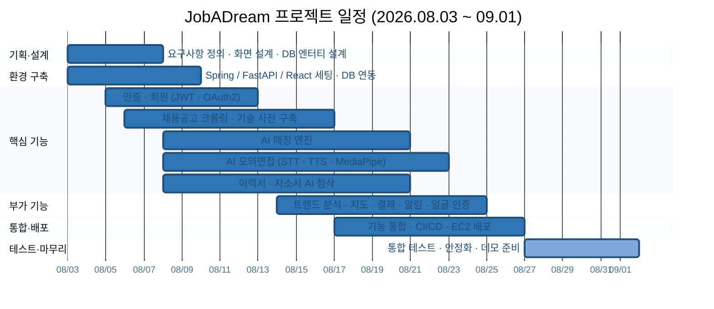
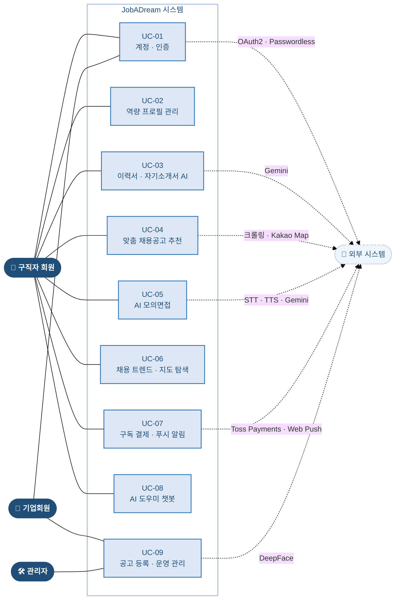
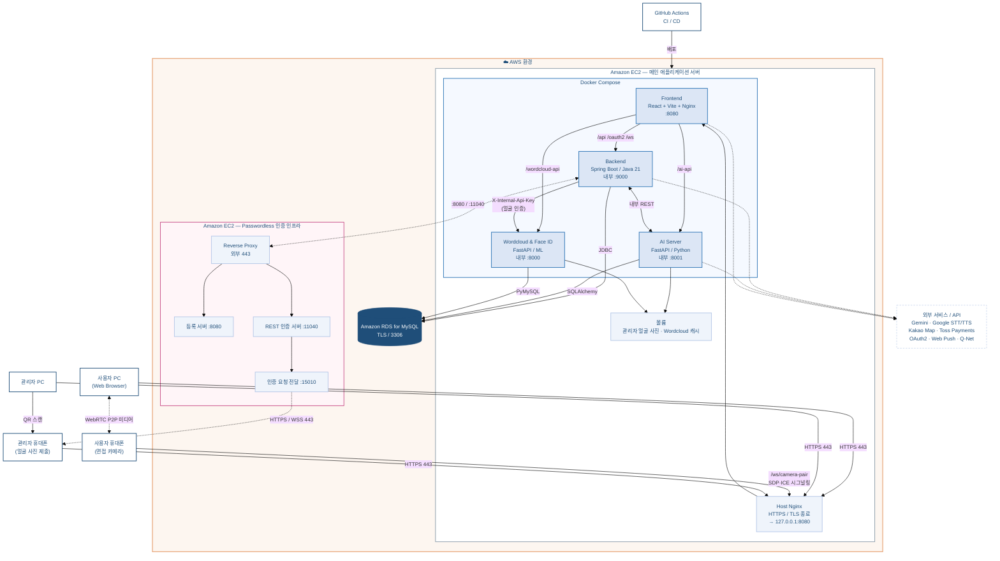
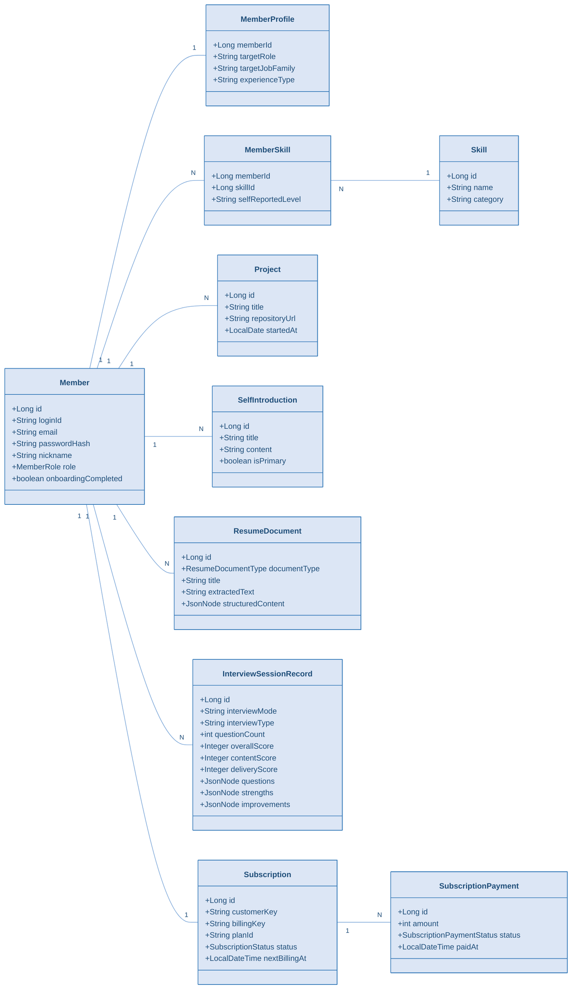
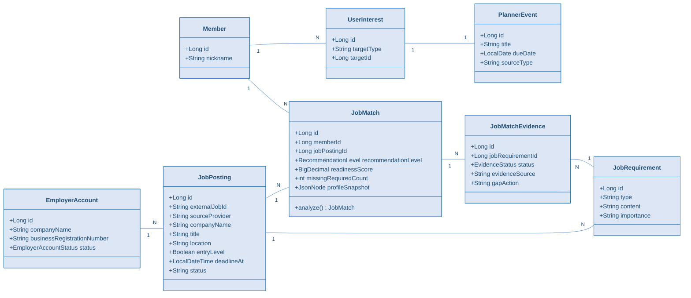
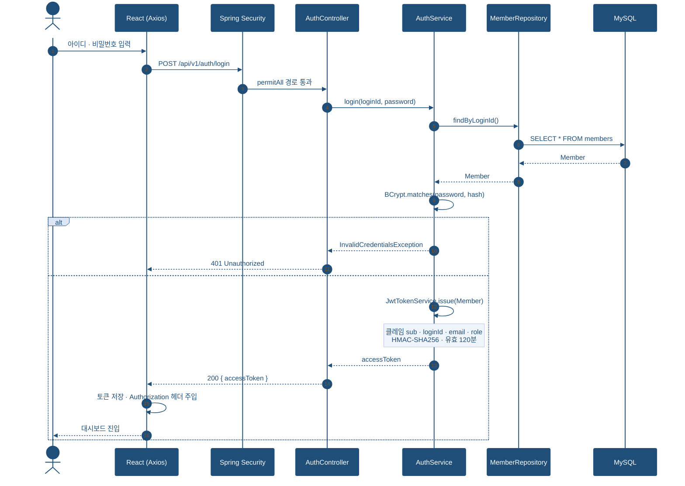
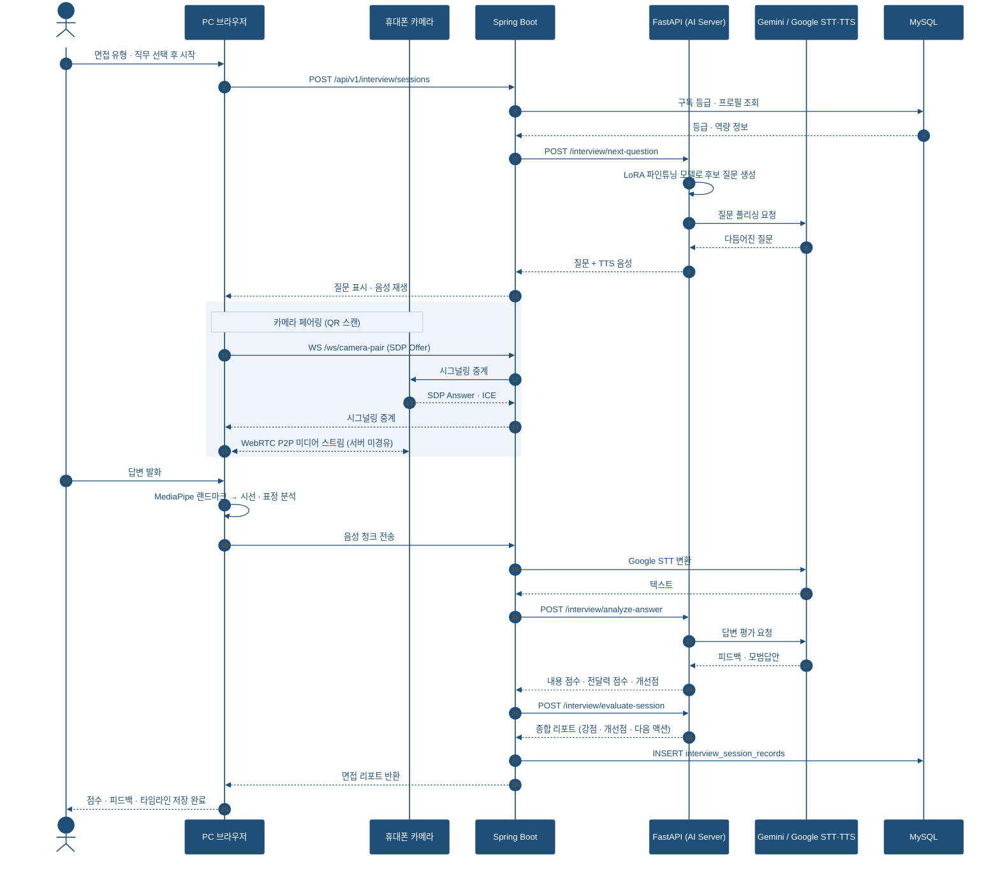
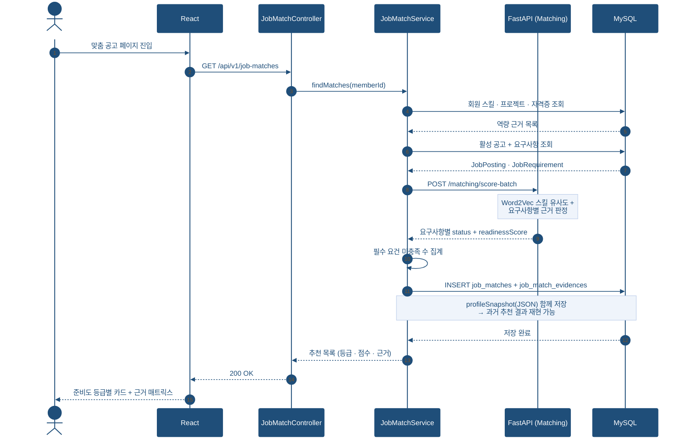
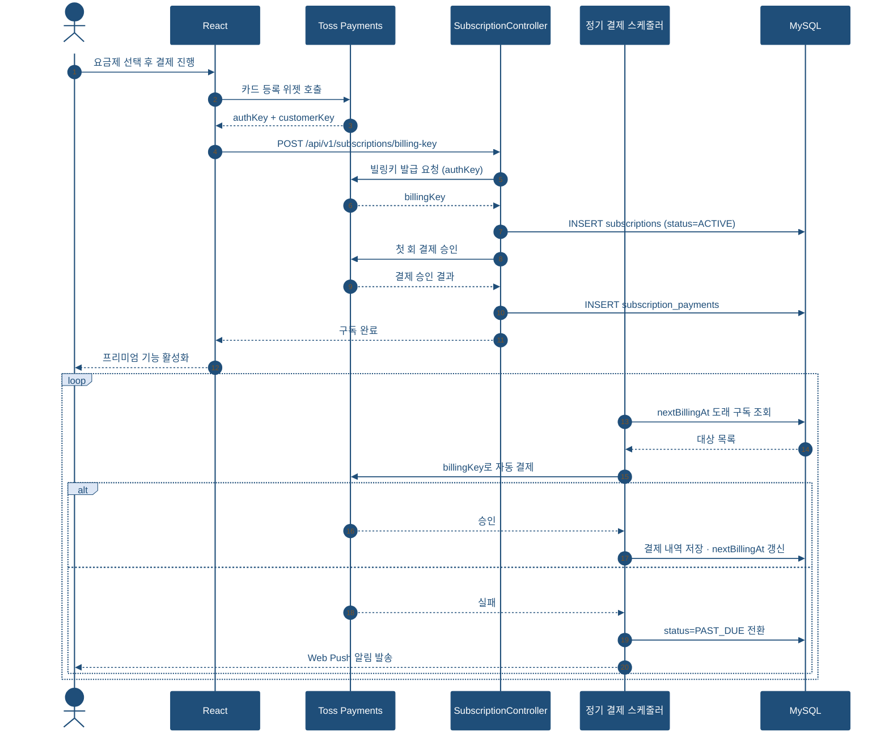
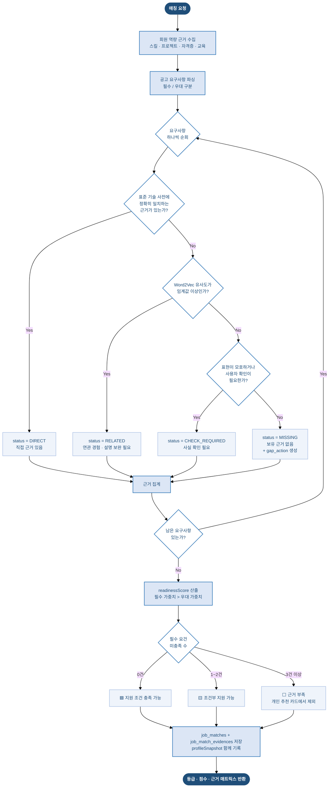

# JobADream 설계 산출물 모음

> **잡아드림 (JobADream)** — AI 맞춤 채용공고 및 모의면접 서비스
> 기간 **2026.08.03 ~ 09.01** · 팀 4인 (김다인 · 김한영 · 성은지 · 오한울) · 총 615 커밋
> 4 Services (React 18 · Spring Boot 3.4 · FastAPI ×2) · 백엔드 16 도메인 / 40 컨트롤러 · MySQL 39 테이블 · AWS EC2 + RDS

포트폴리오·발표자료에 그대로 붙일 수 있도록 **6종 설계 산출물**을 정리했습니다.
모든 Mermaid 다이어그램은 발표자료와 동일한 네이비/블루 팔레트(`#1F4E79` `#2E75B6` `#DCE6F5` `#B4C7E7`)로 스타일을 지정해 두었습니다.

| 산출물 | 무엇을 보여주는가 | 면접에서 받는 질문 |
|---|---|---|
| [1. 간트차트](#1-프로젝트-간트차트) | 5주를 어떻게 쪼개고 관리했는가 | "일정은 어떻게 관리했나요?" |
| [2. 유스케이스](#2-유스케이스-다이어그램) | 서비스 기능 범위와 액터 | "이 서비스가 하는 일이 정확히 뭔가요?" |
| [3. 시스템 아키텍처](#3-시스템-아키텍처-다이어그램) | 서버 구성과 통신 구조 | "배포 구조가 어떻게 되나요?" |
| [4. ERD](#4-erd-데이터베이스-구조도) | 테이블과 관계 | "왜 이렇게 테이블을 나눴나요?" |
| [5. 클래스 다이어그램](#5-클래스-다이어그램) | 도메인 객체 설계 | "연관관계 매핑은 어떻게 했나요?" |
| [6. 시퀀스 · 플로우차트 · API](#6-시퀀스-다이어그램) | 로직 흐름과 인터페이스 | "이 기능은 내부적으로 어떻게 동작하나요?" |

---

## 1. 프로젝트 간트차트

### 1-1. 표 형태 (문서 붙여넣기용)

**프로젝트 일정 (2026.08.03 ~ 09.01 / 총 5주)**

| 단계 | 작업 내용 | 1주차<br>08.03–08.09 | 2주차<br>08.10–08.16 | 3주차<br>08.17–08.23 | 4주차<br>08.24–08.30 | 5주차<br>08.31–09.01 |
|---|---|:---:|:---:|:---:|:---:|:---:|
| **1. 기획 · 설계**<br>`08.03–08.07` | 요구사항 정의서, 화면 설계, DB·엔터티 설계(39테이블), 도메인 패키지 구조 확정 | ███ | | | | |
| **2. 환경 구축**<br>`08.03–08.09` | Spring Boot 3.4 / Java 21, FastAPI, React 18 + Vite 초기 세팅, MySQL + Flyway, Docker Compose | ███ | | | | |
| **3. 인증 · 회원**<br>`08.05–08.12` | JWT 무상태 인증, OAuth2 3사(Google·Kakao·Naver), 이메일 인증 가입, 기업회원 계정 분리 | ███ | ███ | | | |
| **4. 데이터 수집**<br>`08.06–08.16` | 크롤링 기반 채용공고 수집, 표준 기술 사전(skill·alias) 구축, 요구사항 추출 배치 | ███ | ███ | | | |
| **5. AI 매칭 엔진**<br>`08.08–08.20` | 요구사항–근거 매트릭스 판정, 지원 준비도 점수화, Word2Vec 스킬 유사도, 클릭 로그 재학습 | ███ | ███ | ███ | | |
| **6. AI 모의면접**<br>`08.08–08.22` | WebRTC 폰 카메라 페어링, STT·TTS 음성 면접, MediaPipe 비언어 분석, Gemini 평가 리포트 | ███ | ███ | ███ | | |
| **7. 이력서 · 자소서 AI**<br>`08.08–08.20` | AI 이력서 작성, 자기소개서·프로젝트 STAR 첨삭, 기술 요약 합성 | ███ | ███ | ███ | | |
| **8. 부가 기능**<br>`08.14–08.24` | 워드클라우드 트렌드, 지도 기반 공고(Kakao Map), 플래너, Web Push, Toss 구독 결제, 얼굴 인증 관리자 | | ███ | ███ | ███ | |
| **9. 통합 · 배포**<br>`08.17–08.26` | 전체 기능 연동, GitHub Actions CI/CD, Nginx TLS + Docker Compose, EC2·RDS 배포 | | | ███ | ███ | |
| **10. 테스트 · 최종 점검**<br>`08.27–09.01` | 통합 테스트, 오류 수정, 서비스 안정화, 시연·발표 준비 | | | | ███ | ███ |

| | 1주차 | 2주차 | 3주차 | 4주차 | 5주차 |
|---|:---:|:---:|:---:|:---:|:---:|
| **주차별 커밋 수** | 102 | 215 | 221 | 76 | 진행 중 |

> 커밋 수는 실제 저장소 기준(총 615). 3주차에 통합·배포가 겹치며 정점을 찍고, 4주차부터 안정화 단계로 넘어간 흐름이 그대로 보입니다.

### 1-2. Mermaid 간트 (GitHub · Notion 렌더링용)



> **작성 팁**
> 단순히 일정만 나열하지 말고 *"WBS를 10개 작업 단위로 분해해 선행·병렬 관계를 정의하고, 2~3주차에 AI 기능 3종(매칭·모의면접·이력서 첨삭)을 병렬로 진행해 일정을 압축했다"* 는 문장을 함께 적으세요.
> 주차별 커밋 수처럼 검증 가능한 숫자를 옆에 붙이면 "일정 관리를 했다"는 말이 근거를 얻습니다.

---

## 2. 유스케이스 다이어그램

### 2-1. 액터 (Actor)

| 구분 | 액터 | 설명 | 엔티티 |
|---|---|---|---|
| Primary | **구직자 회원** | 역량 프로필을 등록하고 맞춤 공고 추천 · AI 모의면접을 이용하는 주체 | `Member` |
| Primary | **기업회원** | 채용공고를 직접 등록·관리하고 지원 현황 알림을 받는 주체 | `EmployerAccount` |
| Primary | **관리자** | 회원·공고 데이터와 수집 배치를 운영하고 통계를 확인하는 주체 (얼굴 인증 로그인) | `ROLE_ADMIN` |
| Secondary | **외부 시스템** | 공고 원천 데이터, AI·결제·지도·인증 기능을 제공하는 연동 대상 | — |

### 2-2. 유스케이스 도식



### 2-3. 유스케이스 상세

**UC-01. 계정 · 인증**
- 이메일 인증 회원가입 (6자리 코드 · 10분 유효 · 재발송 쿨다운 60초)
- 소셜 로그인 (Google / Kakao / Naver)
- 무상태 JWT 로그인 — `actorType` 클레임으로 회원/기업 토큰 교차 사용 차단
- 기업회원 Passwordless 로그인 (QR + 숫자 매칭)

**UC-02. 역량 프로필 관리**
- 학력 · 경력 · 자격증 등 스펙 등록
- 기술 스택 등록 — 표준 기술 사전(alias)으로 표기 통일
- 프로젝트 · GitHub 저장소 등록 및 AI 코드 분석

**UC-03. 이력서 · 자기소개서 AI**
- AI 스펙 연동 이력서 자동 작성
- 자기소개서 문항별 작성 및 AI 첨삭
- 프로젝트 경험 STAR 구조 첨삭

**UC-04. 맞춤 채용공고 추천**
- 지원 준비도 등급별 공고 필터링
- 요구사항–근거 매트릭스 확인 ("왜 이 결과인가")
- 성장 기회 추천 (교육 · 자격증 · 공모전)
- 관심 공고 등록 → 플래너 마감 일정 자동 생성

**UC-05. AI 모의면접**
- 면접 유형 · 직무 분야 선택 (인성 / 역량 / 직무)
- WebRTC 기반 폰 카메라 페어링 (QR 스캔 → P2P 연결)
- 구독 회원 프로필 연동 맞춤 질문 생성
- STT 답변 인식 → 답변 분석 · 피드백 · 모범답안 제공
- MediaPipe 랜드마크 기반 비언어적 면접 태도 분석
- 면접 이력 타임라인 저장 및 조회

**UC-06. 채용 트렌드 · 지도 탐색**
- KIWI 형태소 분석 기반 키워드 추출 → 워드클라우드 시각화
- Kakao Map 연동 지도 렌더링, Geolocation 기반 현재 위치 공고 조회

**UC-07. 구독 결제 · 푸시 알림**
- Toss Payments 빌링키 등록 · 정기 결제 · 해지
- 마감 임박 Web Push 알림 수신

**UC-08. AI 도우미 챗봇**
- RAG 및 페르소나 적용 챗봇 — 서비스 전반 질문에 실시간 응답

**UC-09. 공고 등록 · 운영 관리**
- *(기업회원)* 자사 채용공고 등록 · 수정 · 마감, 지원 현황 알림
- *(관리자)* DeepFace 얼굴 대조 인증 로그인, 회원·공고 CRUD, 크롤링 배치 실행, 통계 대시보드

---

## 3. 시스템 아키텍처 다이어그램

**한 줄 요약** — EC2 1대 위에서 Docker Compose로 4개 컨테이너를 띄우고, 호스트 Nginx가 TLS를 종료한 뒤 경로 규칙으로 리버스 프록시합니다. DB는 RDS(MySQL)를 3개 서비스가 각자의 드라이버로 접근하고, 기업회원 Passwordless 인증만 별도 EC2로 분리했습니다.



### 3-1. 서비스 구성

| 서비스 | 기술 스택 | 포트 | 역할 |
|---|---|:---:|---|
| **Frontend** | React 18 + TypeScript (Vite), Nginx | 8080 | 정적 SPA 서빙 + 경로별 리버스 프록시 |
| **Backend** | Spring Boot 3.4 / Java 21 | 9000 | 메인 게이트웨이 — 도메인 API 전체 처리 |
| **AI Server** | FastAPI / Python | 8001 | 면접 질문 생성·평가, 이력서 분석, 매칭 스코어링 |
| **Wordcloud & Face ID** | FastAPI / ML (DeepFace, KIWI) | 8000 | 워드클라우드 생성, 관리자 얼굴 대조 인증 |
| **DB** | Amazon RDS for MySQL | 3306 | Backend는 JPA/Flyway, AI는 SQLAlchemy, ML은 PyMySQL |

### 3-2. 설계 포인트

- **Backend가 사실상 게이트웨이** — 대부분의 도메인 API를 직접 처리하고, AI 연산이 필요한 부분만 서버 간 REST로 위임했습니다.
- **서버 간 호출은 `X-Internal-Api-Key`로 검증** — 사용자 JWT가 없는 서버-서버 요청이기 때문에 공용 비밀키를 헤더로 검증합니다.
- **면접 영상은 서버를 거치지 않음** — WebRTC P2P로 PC↔휴대폰이 직접 연결되고, 서버는 `/ws/camera-pair`에서 SDP·ICE 시그널링만 중계합니다. 미디어 트래픽이 EC2를 타지 않아 인스턴스 부하와 비용을 크게 줄였습니다.
- **인증 인프라 분리** — 기업회원 Passwordless 인증은 별도 EC2로 격리해, 메인 서버 장애가 인증까지 번지지 않게 했습니다.

---

## 4. ERD (데이터베이스 구조도)

전체 39개 테이블 중 **핵심 5개 영역**만 뽑아 그렸습니다. 전부 한 장에 넣으면 아무도 읽지 않습니다.

```mermaid
%%{init: {"theme":"base","themeVariables":{
  "primaryColor":"#DCE6F5","primaryTextColor":"#1F4E79","primaryBorderColor":"#2E75B6",
  "lineColor":"#7FA9D9","fontFamily":"Pretendard, sans-serif","fontSize":"13px"
}}}%%
erDiagram
    members ||--|| member_profiles : "1:1 프로필"
    members ||--o{ member_skills : "1:N 보유 기술"
    members ||--o{ projects : "1:N 프로젝트"
    members ||--o{ certificates : "1:N 자격증"
    members ||--o{ self_introductions : "1:N 자기소개서"
    members ||--o{ job_matches : "1:N 매칭 결과"
    members ||--o{ interview_session_records : "1:N 면접 이력"
    members ||--o| subscriptions : "1:1 구독"

    skills ||--o{ member_skills : "표준 기술 사전"
    skills ||--o{ job_skills : "표준 기술 사전"
    skills ||--o{ skill_aliases : "1:N 별칭"

    employer_accounts ||--o{ job_postings : "1:N 공고 등록"
    job_postings ||--o{ job_requirements : "1:N 요구사항"
    job_postings ||--o{ job_skills : "1:N 요구 기술"
    job_postings ||--o{ job_matches : "1:N 매칭 결과"

    job_matches ||--o{ job_match_evidences : "1:N 판정 근거"
    job_requirements ||--o{ job_match_evidences : "요구사항별 근거"
    self_introductions ||--o{ job_matches : "매칭 시 참조"

    subscriptions ||--o{ subscription_payments : "1:N 결제 내역"

    members {
        bigint id PK
        varchar email UK
        varchar nickname
        varchar role
    }
    member_profiles {
        bigint member_id PK_FK
        varchar target_role
        varchar target_job_family
        varchar experience_type
    }
    member_skills {
        bigint id PK
        bigint member_id FK
        bigint skill_id FK
        varchar self_reported_level
    }
    skills {
        bigint id PK
        varchar name
        varchar category
    }
    job_postings {
        bigint id PK
        bigint employer_account_id FK
        varchar title
        varchar company_name
        datetime deadline_at
        varchar status
    }
    job_requirements {
        bigint id PK
        bigint job_posting_id FK
        varchar type
        text content
        varchar importance
    }
    job_matches {
        bigint id PK
        bigint member_id FK
        bigint job_posting_id FK
        bigint self_introduction_id FK
        decimal readiness_score
        varchar recommendation_level
    }
    job_match_evidences {
        bigint id PK
        bigint job_match_id FK
        bigint job_requirement_id FK
        bigint skill_id FK
        varchar status
        text gap_action
    }
    interview_session_records {
        bigint id PK
        bigint member_id FK
        varchar interview_type
        int overall_score
        json questions
    }
    subscriptions {
        bigint id PK
        bigint member_id FK
        varchar plan_id
        varchar status
        datetime next_billing_at
    }
```

### 4-1. 영역별 역할

| 영역 | 핵심 테이블 | 역할 |
|---|---|---|
| **회원 프로필 & 역량** | `members` `member_profiles` `member_skills` `projects` `certificates` | 회원의 목표 · 기술 · 경험 관리 |
| **표준 기술 사전** | `skills` `skill_aliases` `job_skills` | 회원의 skill과 공고의 skill을 같은 기준으로 비교 |
| **자기소개서** | `self_introductions` | 역량 내용 기반 자소서 작성 |
| **AI 매칭** | `job_matches` `job_match_evidences` `job_requirements` | 회원 역량과 공고 요건을 비교해 매칭 |
| **기업회원 & 채용공고** | `employer_accounts` `job_postings` | 기업회원 공고 등록 |

### 4-2. 설계 포인트

- **추천 결과의 근거를 테이블로 남김** — `job_matches`가 점수만 저장하고 끝나지 않고, `job_match_evidences`가 공고 요구사항 한 줄마다 `DIRECT / RELATED / MISSING / CHECK_REQUIRED` 판정과 `gap_action`(보완 액션)을 남깁니다. "왜 이 공고가 추천됐는가"를 화면에서 되짚을 수 있는 구조입니다.
- **표준 기술 사전으로 표기 정규화** — `skills`와 `skill_aliases`를 분리해 "JS / Javascript / 자바스크립트"를 한 스킬로 모읍니다. 회원 스킬(`member_skills`)과 공고 스킬(`job_skills`)이 같은 `skill_id`를 바라보므로 매칭이 문자열 비교가 아닌 ID 비교가 됩니다. **매칭 정확도가 여기서 갈립니다.**
- **외부 공고의 멱등 수집** — `source_provider + external_job_id`를 유니크 키로 잡아 크롤러가 같은 공고를 중복 적재하지 않도록 했습니다.
- **가변 스키마는 JSON 컬럼** — 면접 질문·피드백처럼 개수와 형태가 매번 달라지는 데이터는 정규화 대신 `JSON` 컬럼으로 두고, 조회·집계가 필요한 점수만 별도 컬럼으로 승격시켰습니다.
- **회원과 기업회원 계정 완전 분리** — `members`와 `employer_accounts`를 다른 테이블로 두고 JWT의 `actorType` 클레임으로 교차 접근을 원천 차단했습니다.

---

## 5. 클래스 다이어그램

### 5-1. Diagram A — 회원 · 이력서 · 모의면접 도메인



### 5-2. Diagram B — 채용공고 · AI 매칭 도메인



### 5-3. 설계 포인트

- **도메인 단위 패키지 구조** — 계층(layer) 기준이 아니라 기능(domain) 기준으로 16개 패키지를 나눴습니다. 팀원이 동시에 작업할 때 Git 충돌 지점을 줄이려는 의도적인 선택이었습니다.
- **프로필 스냅샷 보관** — 매칭 시점의 회원 상태를 `profileSnapshot`(JSON)으로 함께 저장해, 이후 프로필이 바뀌어도 과거 추천 결과를 그대로 재현할 수 있게 했습니다.
- **연관관계는 필요한 방향만** — 조회 트래픽이 몰리는 `JobPosting → JobMatch`는 양방향 매핑을 피하고 ID 참조 + 명시적 조회로 두어, 의도치 않은 N+1을 원천 차단했습니다.

---

## 6. 시퀀스 다이어그램

### 6-1. 로그인 (JWT 발급)



### 6-2. AI 모의면접 (핵심 로직)



### 6-3. AI 맞춤 공고 매칭



### 6-4. 구독 결제 (Toss Payments 빌링키)



---

## 7. 플로우차트 — AI 매칭 판정 로직

추천 알고리즘의 분기 처리를 순서도로 정리했습니다. **"왜 이 공고가 이 등급인가"** 를 설명하는 자료입니다.



---

## 8. API 명세서 (핵심 엔드포인트)

전체 40개 컨트롤러 중 **핵심 기능 API**만 발췌했습니다. 인증이 필요한 API는 `Authorization: Bearer {accessToken}` 헤더가 필수입니다.

### 8-1. 인증 · 회원

| Method | Endpoint | 설명 | 인증 |
|:---:|---|---|:---:|
| `POST` | `/api/v1/auth/email-verifications` | 이메일 인증 코드 발송 (6자리 · 10분) | — |
| `POST` | `/api/v1/auth/email-verifications/confirm` | 인증 코드 확인 → `verificationToken` 발급 | — |
| `POST` | `/api/v1/auth/signup` | 회원가입 (verificationToken 필수) | — |
| `POST` | `/api/v1/auth/login` | 로그인 → JWT 발급 | — |
| `GET` | `/oauth2/authorization/{google\|kakao\|naver}` | 소셜 로그인 진입 | — |
| `POST` | `/api/v1/auth/oauth/complete` | 신규 소셜 가입 완료 (약관 동의 · 이메일 확정) | — |
| `POST` | `/api/v1/employer/auth/login` | 기업회원 로그인 (`actorType=EMPLOYER`) | — |

### 8-2. 역량 프로필 · 이력서

| Method | Endpoint | 설명 | 인증 |
|:---:|---|---|:---:|
| `GET` `PUT` | `/api/v1/members/me/career-profile` | 역량 프로필 조회 · 수정 | ✅ |
| `GET` `POST` `DELETE` | `/api/v1/members/me/skills` | 보유 기술 관리 (표준 기술 사전 연결) | ✅ |
| `GET` `POST` `PUT` `DELETE` | `/api/v1/projects` | 프로젝트 CRUD (GitHub URL AI 분석 포함) | ✅ |
| `GET` `POST` `PUT` `DELETE` | `/api/v1/self-introductions` | 자기소개서 CRUD | ✅ |
| `POST` | `/api/v1/resume-documents/analyze` | 이력서 업로드 → 텍스트 파싱 · 구조화 | ✅ |
| `POST` | `/api/v1/resume-documents/generate` | AI 이력서 자동 작성 | ✅ |

### 8-3. 채용공고 · AI 매칭

| Method | Endpoint | 설명 | 인증 |
|:---:|---|---|:---:|
| `GET` | `/api/v1/job-postings` | 공고 목록 (필터 · 페이징) | — |
| `GET` | `/api/v1/job-postings/{id}` | 공고 상세 + 요구사항 | — |
| `GET` | `/api/v1/job-matches` | 내 맞춤 공고 추천 목록 (등급 · 점수) | ✅ |
| `GET` | `/api/v1/job-matches/{id}/evidences` | 요구사항–근거 매트릭스 | ✅ |
| `GET` | `/api/v1/location-jobs` | 위치 기반 공고 조회 (Kakao Map) | — |
| `POST` | `/api/v1/interests` | 관심 공고 등록 → 플래너 일정 자동 생성 | ✅ |

### 8-4. AI 모의면접

| Method | Endpoint | 설명 | 인증 |
|:---:|---|---|:---:|
| `POST` | `/api/v1/interview/sessions` | 면접 세션 시작 (유형 · 직무 선택) | ✅ |
| `WS` | `/ws/camera-pair` | 휴대폰 카메라 페어링 시그널링 (SDP · ICE) | ✅ |
| `POST` | `/ai-api/interview/next-question` | 다음 질문 생성 (LoRA + Gemini) | 🔒 내부 |
| `POST` | `/ai-api/interview/analyze-answer` | 답변 분석 → 피드백 · 모범답안 | 🔒 내부 |
| `POST` | `/ai-api/interview/evaluate-session` | 세션 종합 평가 리포트 | 🔒 내부 |
| `POST` | `/ai-api/interview/tts` | 질문 음성 합성 | 🔒 내부 |
| `GET` | `/api/v1/interview/records` | 면접 이력 타임라인 조회 | ✅ |

### 8-5. 구독 · 알림 · 관리자

| Method | Endpoint | 설명 | 인증 |
|:---:|---|---|:---:|
| `POST` | `/api/v1/subscriptions/billing-key` | Toss 빌링키 등록 + 첫 결제 | ✅ |
| `DELETE` | `/api/v1/subscriptions` | 구독 해지 | ✅ |
| `GET` | `/api/v1/subscriptions/payments` | 결제 내역 조회 | ✅ |
| `POST` | `/api/v1/push-subscriptions` | Web Push 구독 등록 (VAPID) | ✅ |
| `POST` | `/wordcloud-api/face/verify` | 관리자 얼굴 대조 인증 (DeepFace) | 🔒 내부 |
| `POST` | `/api/v1/admin/crawl/trigger` | 공고 수집 배치 수동 실행 | 🛠 관리자 |

**공통 응답 규격**

```jsonc
// 성공
{ "data": { /* ... */ }, "timestamp": "2026-08-26T14:30:00" }

// 실패
{
  "code": "INVALID_CREDENTIALS",
  "message": "아이디 또는 비밀번호가 올바르지 않습니다.",
  "timestamp": "2026-08-26T14:30:00"
}
```

| 상태 코드 | 의미 |
|:---:|---|
| `200` / `201` | 정상 처리 |
| `400` | 요청 값 검증 실패 |
| `401` | 토큰 없음 · 만료 · 자격 증명 불일치 |
| `403` | 권한 부족 (`actorType` 불일치 포함) |
| `404` | 리소스 없음 |
| `409` | 중복 (이메일 · 공고 멱등키 등) |
| `500` | 서버 오류 |

---

## 9. 포트폴리오 배치 순서

| 순서 | 항목 | 보여주는 것 |
|:---:|---|---|
| 1 | 프로젝트 개요 및 기획 배경 | 어떤 문제를 왜 이 서비스로 풀었는지 |
| 2 | **프로젝트 간트차트** | WBS 분해와 병렬 진행으로 5주를 관리한 근거 |
| 3 | **유스케이스 다이어그램** | 액터별 기능 범위를 한 화면에 |
| 4 | **시스템 아키텍처 다이어그램** | 4개 서비스 구성과 배포 구조 |
| 5 | **ERD · 클래스 다이어그램** | 도메인 모델과 설계 의도 |
| 6 | **시퀀스 · 플로우차트 · API 명세** | 핵심 로직의 내부 동작 |
| 7 | 핵심 구현 기능 상세 | AI 모의면접 · AI 매칭 엔진을 실제 화면과 함께 |
| 8 | 트러블슈팅 | 문제 → 원인 분석 → 해결 → 결과 수치 형식으로 |

---

### 색상 팔레트 (발표자료 기준)

| 용도 | HEX | 미리보기 |
|---|---|---|
| 메인 네이비 (제목 · 강조) | `#1F4E79` | ██████ |
| 서브 블루 (테두리 · 링크) | `#2E75B6` | ██████ |
| 포인트 블루 (아이콘) | `#3D8BFD` | ██████ |
| 박스 채움 | `#DCE6F5` | ██████ |
| 옅은 배경 | `#EFF4FB` | ██████ |
| 페리윙클 (슬라이드 테두리) | `#B4C7E7` | ██████ |
