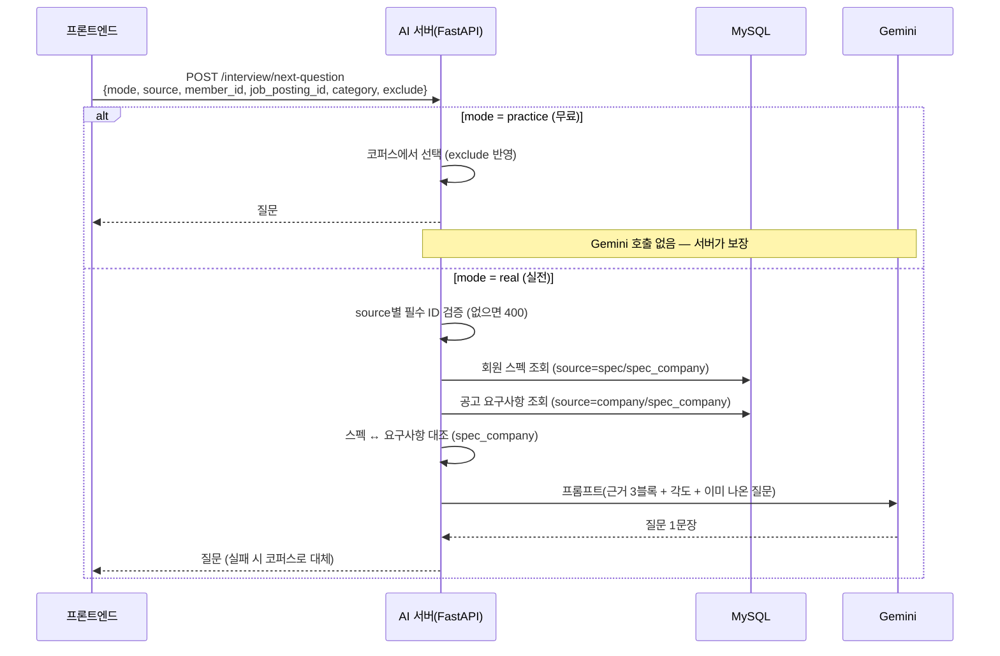
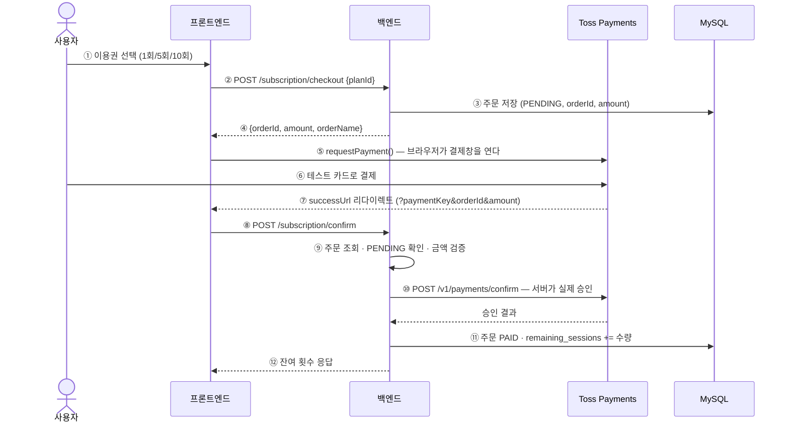

# 발표 자료용 정리 — AI 모의면접 / 실전면접

> PPT 제작용 문서. 각 절이 슬라이드 한 장에 대응한다.
> **[비개발자]** = 인사담당자·심사위원이 흐름을 이해하는 데 필요한 내용
> **[현업자]** = 개발자가 "왜 그렇게 만들었는지"를 보는 부분 — 질의응답 대비
>
> 구현 세부는 [mock-interview-tech-reference.md](./mock-interview-tech-reference.md) 참고.

---

## 슬라이드 1 — 한 줄 요약

> **면접 연습을 "질문 받고 답하기"에서 끝내지 않고, 내가 어떻게 말하고 어떻게 보였는지까지 근거 있는 수치로 돌려주는 기능.**

취업 준비생이 실제 화상면접과 같은 흐름으로 연습하고, 답변 내용 · 말투 · 화면 앞에서의 행동을 함께 분석받는다.

---

## 슬라이드 2 — 두 가지 모드로 나눈 이유 **[비개발자]**

|  | 무료 **모의면접** | **실전면접** (이용권) |
|---|---|---|
| 질문 출처 | 검수된 로컬 질문 코퍼스 | AI가 내 스펙·지원 공고를 읽고 생성 |
| 질문 수 | 2~5개 | 5~10개 |
| 쓰는 내 정보 | 목표 직무만 | 스펙 / 채용공고 (선택) |
| 비용 | 없음 | 이용권 1회 |

**왜 나눴나** — AI 질문 생성은 사용자가 한 번 연습할 때마다 비용이 발생한다. 반면 "면접 흐름에 익숙해지는 것"은 이미 검수된 질문 풀로 충분하다. 그래서 **연습은 누구나 무제한, 실전은 이용권**으로 갈랐다.

> 🎤 **발표 포인트**: "무료 사용자에게도 서비스의 본질(면접 흐름 연습)은 열어두고, 비용이 실제로 드는 맞춤 생성만 유료로 뒀습니다."

---

## 슬라이드 3 — 사용자 흐름 **[비개발자]**

```
① 모드 선택            모의면접 / 실전면접
        ↓
② 설정                 무료: 목표 직무 · 질문 유형 · 질문 수(2~5)
                       실전: 질문 근거 · 준비 중인 공고 · 질문 수(5~10)
        ↓
③ 기기 점검            카메라·마이크 확인 + 기준 자세 보정(2~3초)
        ↓
④ 면접 진행            질문 낭독(TTS) → 답변 녹음 → 분석 → 다음 질문
                       모든 질문에서 "건너뛰기" 가능
        ↓
⑤ 질문별 지표          말속도 · 침묵 · 음높이 · 눈 깜빡임 · 시선 · 자세
        ↓
⑥ AI 종합 평가         버튼을 눌렀을 때만 호출 (점수 · 강점 · 개선점 · 모범답안)
        ↓
⑦ 타임라인 저장        "지난번보다 나아졌는지"를 볼 수 있게 기록
```

**설정 화면이 모드에 따라 바뀐다** — 모드를 고른 뒤 그 모드에 필요한 설정만 단계적으로 보여준다. 실전면접에는 "면접 유형/분야"가 없다(질문 구성이 자동으로 정해지므로), 모의면접에는 "공고 선택"이 없다(코퍼스만 쓰므로).

---

## 슬라이드 4 — 실전면접 질문은 어떻게 구성되나 **[비개발자]**

질문 5~10개가 무작위가 아니라 **실제 면접 순서**로 배치된다.

```
1번        자기소개                         (고정)
2~N번      스펙·공고 근거 맞춤 질문          ← RAG
           행동 질문 (협업/문제해결)          5~7개면 1개, 8~10개면 2개
마지막     입사 후 포부                     (고정, 회사를 골랐으면 회사명 포함)
```

**질문 근거는 세 가지 중 선택**

| 근거 | 무엇을 읽나 |
|---|---|
| 스펙만 | 내가 저장한 기술·프로젝트·자격증·자기소개서 |
| 회사만 | 지원 공고에서 추출된 요구사항 |
| 스펙 + 회사 | 둘을 **대조**해서 "확인된 역량 / 확인되지 않은 역량" |

---

## 슬라이드 5 — 기술 흐름: 질문 생성 **[현업자]**



**설계 포인트 3가지**

1. **무료/유료 분리를 서버가 보장한다** — `mode=practice` 분기가 핸들러 **맨 앞**에 있어서, 프론트가 `member_id`나 `job_posting_id`를 보내더라도 RAG 조회·Gemini 호출 코드에 **도달 자체가 불가능**하다. `mode` 필드가 없으면 무료로 간주한다(비용이 드는 쪽을 기본값으로 두지 않는다).

2. **RAG 조회는 전부 fail-open, 대신 입력 검증은 fail-fast** — DB가 죽어도 질문 생성이 멈추면 안 되므로 조회 실패는 조용히 넘어간다. 하지만 그 때문에 ID가 빠진 요청도 조용히 "근거 없는 질문"이 되어버리므로, **필수 ID 누락은 400으로 끊는다.**

3. **무료는 순차 호출, 실전은 병렬 호출** — 무료는 순차라서 매번 "지금까지 나온 질문"을 `exclude`로 넘길 수 있어 중복이 원천 차단된다. 실전은 5~10개를 하나씩 기다리면 시작이 너무 느려서 병렬로 쏘고, 서로의 결과를 모르니 **중복/실패한 슬롯만 코퍼스로 대체**한다. 그래도 못 채우면 중복으로 자리를 메우지 않고 **다시 시도 화면**을 보여준다.

---

## 슬라이드 6 — "모르는 것을 아는 척하지 않기" **[현업자]** ⭐

이 기능에서 가장 신경 쓴 원칙. 발표에서 차별점으로 쓸 부분.

**① 스펙에 없으면 "없다"고 단정하지 않는다**

스펙과 공고 요구사항을 대조할 때, 일치하지 않는 항목을 "이 지원자에게 없는 역량"으로 넘기면 AI는 그걸 사실로 전제한 압박 질문을 만든다. 그래서 결과를 두 가지로만 표기한다.

```
보유 근거 확인          : Java 경험 (일치 키워드: java)
스펙에서 확인되지 않음   : Kubernetes 운영
```

프롬프트에도 *"확인되지 않음은 없다는 뜻이 아니라 스펙에 적혀 있지 않다는 뜻 — 단정하거나 추궁하지 말 것"* 규칙을 함께 건다.

**② 한 글자 키워드는 대조에서 제외**

`C`, `R` 같은 진짜 기술명을 놓치는 손해가 있지만, 한글 한 글자가 요구사항 문장 아무 데나 걸려 "보유 확인"으로 **잘못 표시되는 오탐**이 더 위험하다고 판단했다.

**③ 개인정보는 프롬프트에 필요한 만큼만**

자기소개서 원문을 통째로 싣지 않고 400자까지만 자른다. **조회 시점과 프롬프트 조립 시점 양쪽에서** 자르는데, 길이 제한이 프롬프트 예산 문제이기 전에 개인정보 취급 약속이기 때문이다.

---

## 슬라이드 7 — 답변 분석: 음성 **[현업자]**

```
녹음(MediaRecorder) → AI 서버 → ffmpeg 디코딩 → ┬ STT (Google Cloud STT)
                                                  └ 음성 지표 (numpy 직접 구현)
```

| 지표 | 화면 표시 |
|---|---|
| 말속도 | 권장 범위(분당 220~271자)와 함께 게이지로 |
| 침묵 비율 · 긴 침묵 횟수 | 정상 범위 밴드 + 실제값 마커 |
| 평균 음높이 · 변동폭 · 음량 떨림 | 수치만 (비교 기준 없음을 명시) |

**설계 포인트**

- **기준이 있는 지표만 게이지를 그린다.** 말속도·침묵처럼 일반적인 권장 범위가 있는 것만 범위 밴드를 보여주고, 음높이 변동폭처럼 기준이 없는 값은 숫자만 보여준다. **없는 기준을 있는 것처럼 보여주지 않기 위해서다.**
- **`librosa` 의존성을 제거하고 numpy로 직접 구현했다.** librosa가 내부적으로 `numba`를 쓰는데, numba의 네이티브 DLL이 Windows 스마트 앱 컨트롤에 차단되는 환경이 실제 팀원 PC에서 재현됐다. 정규화 자기상관 기반 피치 추정과 RMS 기반 무음 구간 계산을 직접 작성해 의존성 자체를 없앴다.
- **깜빡임 카운트는 히스테리시스 + 디바운스.** 시작/종료 임계값을 나누고 최소 간격(350ms)을 둬서, 임계값 근처 흔들림이 한 번의 깜빡임을 여러 번으로 세는 문제를 막았다.

---

## 슬라이드 8 — 답변 분석: 얼굴(MediaPipe) **[현업자]** ⭐

**얼굴 영상은 서버로 전송되지 않는다.** 브라우저 안에서 MediaPipe(WASM)로 프레임을 읽어 수치만 계산하고, 서버로는 답변 음성과 집계된 숫자만 올라간다.

**핵심: 기준 자세 보정**

```
기기 점검 단계 (2~3초)              면접 중
────────────────────              ────────────────
연속 유효 프레임에서              매 프레임의 yaw/pitch를
yaw·pitch·홍채·얼굴중심의    →    기준 대비 차이로 계산
중앙값 = "이 사람의 정면"
```

**왜 필요한가** — 카메라 높이와 평소 자세는 사람마다 다르다. 이전 구현은 코끝의 2D 이동량 하나로 "고개 움직임"을 만들었는데, **노트북을 옆에 두고 쓰는 사람은 가만히 있어도 계속 "고개를 돌리고 있다"** 로 집계됐다. 지금은 얼굴 변환 행렬에서 회전을 뽑아 기준 자세 대비 상대값으로 잰다.

**분석 신뢰도 3단계**

| 등급 | 조건 | 화면 |
|---|---|---|
| 충분 | 5초 이상 · 유효 프레임 30개 이상 · 보정 완료 · 인식률 60% 이상 | 수치 표시 |
| 참고 | 위 조건 중 인식률만 미달 | 수치 + "참고용" 배지 |
| **부족** | 답변이 짧거나, 유효 프레임 부족, **또는 보정 실패** | **수치를 아예 안 보여주고 촬영 환경 안내** |

> 근거로 쓸 수 없는 숫자를 띄워두면 사용자는 그걸 근거로 받아들인다. 그래서 부족할 때는 숨긴다.

**하지 않는 것** — 표정으로 긴장도·자신감·성격·진실성을 판정하지 않는다. 카메라로 알 수 있는 건 "고개가 얼마나 움직였나 / 카메라를 얼마나 봤나 / 얼굴이 화면 안에 있었나" 같은 **관찰 가능한 행동**뿐이고, 그걸 심리 상태로 번역하는 순간 근거 없는 판정이 된다.

---

## 슬라이드 9 — AI 종합 평가 **[비개발자 + 현업자]**

질문별 지표를 먼저 보여주고, **사용자가 "AI 분석 보기"를 눌렀을 때만** 세션 전체를 Gemini 한 번으로 평가한다(비용 절약).

평가 입력: 질문 + STT 답변 + 음성 지표 + 얼굴 지표(신뢰도 포함)
평가 출력: 종합/내용/전달력 점수 · 강점 · 개선점 · 다음 연습 방향 · 질문별 피드백과 모범답안 · **비언어 행동 리뷰**

**설계 포인트**

- **비언어 리뷰는 신뢰도가 "충분"할 때만 생성한다.** 그렇지 않으면 프롬프트가 `null`을 강제하고, 화면에는 "분석 데이터 부족" 안내가 뜬다.
- **금지어 규칙** — 긴장·자신감·감정·성격·진실성 추정 금지를 프롬프트에 명시.
- **건너뛴 질문은 미응답으로 처리** — 프론트가 저장한 스킵 문구를 AI가 "성의 없는 답변"으로 평가하지 않도록 프롬프트에 명시한다.
- **음성/얼굴 지표가 없으면(채팅 모드) 전달력 점수를 null로 강제** — 근거 없이 점수를 만들지 않는다.

---

## 슬라이드 10 — 이용권 결제 흐름 **[현업자]**

> ⚠️ 이전 자료의 "Toss 빌링(자동결제)" 다이어그램은 **사실과 다르다.** 빌링 API는 테스트 환경에서도 별도 계약이 필요해 사용하지 못했고, **일반 결제창(Toss Payments)** 으로 구현했다. `billing_key` 컬럼은 그때의 흔적으로 남아 있으나 값이 채워지지 않는다.



**놓치기 쉬운 3가지**

1. **토스와 두 번 만난다** — ⑤는 브라우저가 결제창을 여는 것, ⑩은 서버가 승인 API를 부르는 것. 리다이렉트만으로는 결제가 확정되지 않는다.
2. **금액 검증**(⑨) — checkout 때 서버가 정한 금액과 리다이렉트로 돌아온 금액을 비교한다. 클라이언트가 금액을 조작해 보낼 수 없게 하는 토스 가이드 권장 절차.
3. **잔여 횟수는 `subscriptions` 테이블에 있다** — `members`가 아니다. 주문 이력은 `subscription_payments`(PENDING/PAID/FAILED).

**상품**

| 상품 | 가격 | 회당 |
|---|---|---|
| 1회권 | 1,500원 | 1,500원 |
| 5회권 | 5,900원 | 1,180원 |
| 10회권 | 9,900원 | 990원 |

무료 사용자도 **매달 1회**를 받는다. 모의면접은 이용권 없이 무제한.

**차감 시점** — 시작 버튼이 아니라 **질문 조립이 성공한 직후**. 시작 시점에 차감하면 AI 생성이 전부 실패했는데도 횟수가 날아가고, 세션 종료 시점에 차감하면 질문 생성 비용은 이미 나갔는데 중간에 나간 사용자가 공짜가 된다.

---

## 슬라이드 11 — 발표 중 나올 만한 질문 **[현업자]**

**Q. AI가 이상한 질문을 만들면?**
3중 폴백이다. Gemini 실패/중복 → 코퍼스 대체 → 그래도 못 채우면 세션을 시작하지 않고 재시도 안내. 코퍼스는 AI Hub 실제 면접 질문 + 검수를 거친 생성 질문이라 안전한 대체 풀이다.

**Q. 얼굴 데이터는 어디에 저장되나?**
저장하지 않는다. 브라우저 안에서 계산하고, 서버로는 집계된 비율 수치만 간다. 원시 랜드마크(478개 좌표)는 샘플에도 보관하지 않는다.

**Q. 점수는 어떻게 매기나?**
내용 점수는 답변 텍스트만 근거로 하고, 음성·얼굴 지표는 **전달력 점수에만** 반영한다. 지표가 없으면 전달력은 null이다.

**Q. 비용 관리는?**
무료 경로는 서버 구조상 AI를 호출할 수 없다. 유료 세션 하나당 Gemini 호출은 질문 수에 따라 4~9회(질문 `n-2`회 + 종합 평가 1회)이고, 가격을 최대치 기준으로 책정했다.
