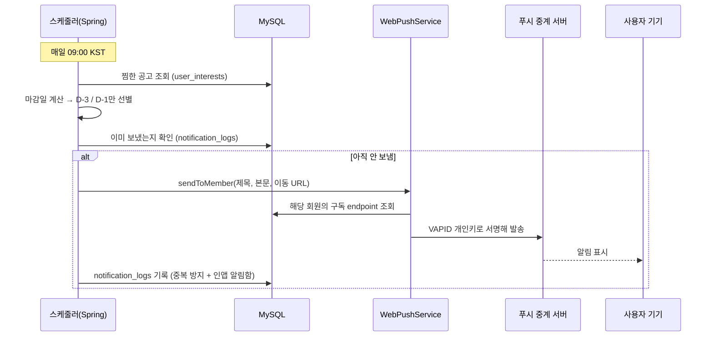

# 발표 자료용 정리 — PWA & 웹푸시 알림

> PPT 제작용 문서. 각 절이 슬라이드 한 장에 대응한다.
> **[비개발자]** = 인사담당자·심사위원이 흐름을 이해하는 데 필요한 내용
> **[현업자]** = 개발자가 "왜 그렇게 만들었는지"를 보는 부분 — 질의응답 대비

---

## 슬라이드 1 — 한 줄 요약

> **찜해둔 공고의 마감일과 새로 뜬 맞춤 공고를, 사용자가 사이트에 들어와 있지 않아도 알려준다.**

취업 준비에서 가장 뼈아픈 실수는 "지원하려던 공고를 놓치는 것"이다. 그건 나중에 되돌릴 수 없다. 그래서 앱 밖으로 나가서 알리는 수단이 필요했고, 설치형 앱 없이 웹만으로 그걸 하기 위해 **PWA + 웹푸시**를 붙였다.

---

## 슬라이드 2 — 무엇을 알려주나 **[비개발자]**

| 알림 | 언제 | 조건 |
|---|---|---|
| **마감 임박** | 매일 오전 9시 | 내가 찜한 공고 중 마감 **D-3 / D-1** |
| **맞춤 새 공고** | 매일 오전 8시 30분 | 최근 24시간 내 새로 "지금 지원 가능"으로 분석된 공고 |
| **무료 이용권 도착** | 매달 1일 오전 9시 10분 | 실전면접 무료 1회 지급 + **현재 잔여 횟수 안내** |

- 상시채용이거나 마감일 정보가 없는 공고는 "마감 임박"이 성립하지 않아 제외한다.
- 같은 공고에 대해 같은 알림을 두 번 보내지 않는다.
- 알림을 눌러 들어오면 해당 공고 상세로 바로 이동한다.

> 🎤 **발표 포인트**: "내가 관심을 표시한 공고에 대해서만, 놓치면 되돌릴 수 없는 시점에, 낮은 빈도로 보냅니다. 알림은 많이 보낼수록 꺼집니다."

---

## 슬라이드 3 — 왜 PWA가 필요했나 **[비개발자]**

웹사이트는 원래 브라우저를 닫으면 알림을 보낼 수 없다. **PWA(Progressive Web App)로 만들면 웹사이트를 앱처럼 설치할 수 있고, 그 상태에서 푸시 알림을 받을 수 있다.**

특히 **iOS는 홈 화면에 추가한 상태에서만 웹푸시가 동작한다**(iOS 16.4+). 앱스토어 심사 없이 아이폰에서도 알림을 보내려면 PWA가 사실상 유일한 길이었다.

**우리가 만든 것은 "웹푸시 전용 PWA"다.** 오프라인 캐싱은 넣지 않았다 — 채용공고는 실시간성이 중요해서 캐시된 옛 데이터를 보여줄 이유가 없고, 목적이 "설치 가능하게 만들어 알림을 받는 것"이었기 때문이다. (의도적인 선택이며, 서비스워커에 `fetch` 핸들러가 없는 이유이기도 하다.)

---

## 슬라이드 4 — 구성 요소 **[현업자]**

빌드 플러그인 없이 정적 파일 3개 + 등록 코드로 구성했다. Vite가 `public/`을 그대로 `dist/` 루트에 복사하는 성질을 이용한다.

```
public/manifest.json   →  /manifest.json    앱 이름 · 아이콘 · standalone 표시
public/sw.js           →  /sw.js            push · notificationclick 핸들러
index.html                                  <link rel="manifest">, theme-color, apple-touch-icon
src/main.tsx                                load 시 navigator.serviceWorker.register("/sw.js")
```

```jsonc
// manifest.json
{
  "name": "Job-A-Dream AI",
  "short_name": "Job-A-Dream",
  "start_url": "/",
  "display": "standalone",     // 주소창 없이 앱처럼 실행
  "theme_color": "#10233f",
  "icons": [ /* 192 / 512 */ ]
}
```

서비스워커 등록은 **실패해도 조용히 넘어간다** — 지원하지 않는 브라우저에서 앱 전체가 죽으면 안 되고, 알림 기능만 못 쓰면 된다.

---

## 슬라이드 5 — VAPID: 웹푸시의 신분증 **[현업자]** ⭐

발표에서 "왜 키가 두 개인가"를 설명해야 하는 부분.

웹푸시는 우리 서버가 사용자 기기로 **직접 보낼 수 없다.** 반드시 브라우저 회사의 중계 서버를 거친다.

```
우리 백엔드  →  구글 FCM / 애플 / 모질라  →  사용자 기기
```

중계 서버 입장에서 아무나 "이 사람에게 알림 보내줘" 하면 스팸이 된다. 그래서 **보내는 서버가 자기 신분을 증명하는 규격**이 VAPID이고, 공개키/개인키 한 쌍이 그 신분증이다.

```
① 백엔드 → 프론트     GET /api/v1/push/vapid-public-key         공개키 전달
② 프론트 → 브라우저   pushManager.subscribe({ applicationServerKey })
                      ↳ 브라우저가 "이 공개키에 묶인" 구독 주소(endpoint) 발급
③ 프론트 → 백엔드     POST /api/v1/push/subscribe                endpoint 저장
④ 발송 시            백엔드가 개인키로 서명해 endpoint로 전송
⑤ 중계 서버          공개키로 서명 검증 → 통과하면 기기로 전달
```

**운영 시 주의** — 구독은 **발급 당시의 공개키에 묶인다.** 키를 교체하면 기존 구독이 전부 무효가 되고 사용자가 알림을 다시 켜야 한다. 한 번 정하면 계속 쓰는 값으로 다뤄야 한다.

---

## 슬라이드 6 — 알림 발송 흐름 **[현업자]**



**설계 포인트 3가지**

1. **중복 발송 방지를 별도 카운터 없이 처리** — `(회원, 대상 종류, 대상 ID, 알림 종류)` 조합으로 `notification_logs`에 한 행만 남긴다. 스케줄러가 매일 돌아도 같은 공고의 D-3 알림은 한 번만 나간다.

2. **그 로그가 인앱 알림함을 겸한다** — 발송 당시의 제목/본문/이동 URL을 함께 스냅샷해두니, 별도 테이블 없이 상단바 종 아이콘 알림 목록으로 그대로 재사용된다. 푸시를 못 받는 사용자(알림 권한 거부, iOS 미설치)도 사이트에 들어오면 볼 수 있다.

3. **fail-open** — VAPID 키가 설정돼 있지 않으면 `WebPushService`가 스스로 비활성화되고 아무것도 보내지 않는다. 알림 하나 때문에 다른 기능이 죽지 않는다.
   > ⚠️ **운영 함정**: 이 fail-open은 **예외도 에러 로그도 남기지 않는다.** "알림이 안 온다"는 제보를 받으면 코드보다 **환경변수(VAPID 3종)부터** 확인해야 한다. 그래서 `deploy/jobpilot.env.example`에 항목과 생성 방법을 주석으로 명시해뒀다.

---

## 슬라이드 7 — iOS 제약 **[비개발자 + 현업자]**

| | Android / 데스크톱 Chrome | iOS Safari |
|---|---|---|
| 웹푸시 | 브라우저에서 바로 가능 | **홈 화면에 추가한 뒤에만** 가능 (16.4+) |
| 권한 요청 | `pushManager.subscribe()`가 암묵적으로 처리 | `Notification.requestPermission()`을 **사용자 클릭 핸들러 안에서 명시적으로** 먼저 호출해야 안정적 |

iOS는 WebKit 제약이 많아 실패해도 원인이 안 보인다. 그래서 실패 메시지에 원인(`e.name: e.message`)을 그대로 노출하고, "아이폰이라면 홈 화면에 추가한 뒤 다시 시도해달라"는 안내를 붙였다. **원격 기기라 개발자도구를 못 여는 상황을 전제한 디버깅 장치다.**

---

## 슬라이드 8 — 알림 설계에서 지킨 원칙 **[현업자]** ⭐

발표에서 "그냥 알림 붙였다"와 차별화되는 부분.

**① 알림은 아껴 쓴다**

| 알림 | 정당성 |
|---|---|
| 마감 임박 | 사용자가 **직접 찜한** 공고(동의 기반) · 놓치면 **되돌릴 수 없음** · 빈도 낮음 → 푸시에 적합 |
| 맞춤 새 공고 | 시스템 판단 · 매일 발생 가능 · 놓쳐도 목록에서 볼 수 있음 → **이메일 백업을 함께 둠** |
| 무료 이용권 도착 | 사용자에게 **이득이 되는 소식** · 한 달에 한 번뿐 · 정책 인지 효과 |

**이용권 알림은 명분을 뒤집어서 만들었다.** "0회입니다, 구매하세요"를 주기적으로 보내면 그건 안내가 아니라 광고다. 대신 매달 지급되는 무료 1회를 알리면서 **그 김에 현재 잔여 횟수를 같이** 알린다. 사용자가 잔여 횟수를 알아야 하는 진짜 시점은 차감되는 순간(면접을 막 시작한 참이라 신경 쓰지 않는다)이 아니라 **다음에 들어와서 실전면접을 누르기 전**이기 때문이다.

알림이 쌓이면 사용자는 알림을 끄고, 그러면 **정작 중요한 마감 알림까지 같이 죽는다.** 그래서 시의성이 낮은 알림은 푸시 비중을 줄였다.

**② 푸시와 인앱 알림함은 대체재가 아니다**

```
푸시     앱 밖에서 두드리기   (즉시성)
알림함   들어왔을 때 확인     (기록 · 복구)
이메일   푸시를 못 받는 사용자 백업
```

**③ 알림 하나가 서비스를 망가뜨리지 않게**

키가 없으면 조용히 끄고, 구독 하나가 만료됐으면 그것만 건너뛰고 나머지에 계속 보낸다.

---

## 슬라이드 9 — 발표 중 나올 만한 질문 **[현업자]**

**Q. 왜 앱을 안 만들고 PWA로?**
앱스토어 심사·배포 비용 없이 설치형 경험과 푸시를 얻기 위해서다. 특히 이 서비스에서 푸시가 필요한 시나리오(마감 임박)는 하루 한 번 짧은 알림이라 네이티브 앱의 다른 기능이 필요 없었다.

**Q. 알림 스팸이 되지 않나?**
마감 알림은 사용자가 직접 찜한 공고에 대해서만, 공고 하나당 최대 2번(D-3, D-1) 나간다. 발송 이력을 DB에 남겨 같은 알림이 반복되지 않는다.

**Q. 오프라인에서도 되나?**
오프라인 캐싱은 의도적으로 넣지 않았다. 채용공고는 실시간성이 중요해서 캐시된 옛 데이터를 보여주는 게 오히려 해롭다. PWA를 쓴 목적은 오프라인이 아니라 **설치 가능성(=웹푸시 자격)** 이다.

**Q. 알림 권한을 거부한 사용자는?**
인앱 알림함(상단바 종 아이콘)에 동일한 내용이 쌓인다. 발송 이력과 알림함이 같은 테이블이라 자동으로 그렇게 된다.

---

## 부록 — 화면에서 확인하는 방법

| 확인할 것 | 위치 |
|---|---|
| 서비스워커 등록 | 개발자도구 → Application → Service Workers |
| manifest 인식 | Application → Manifest |
| 알림 켜기/끄기 | 마이페이지 → 알림 섹션 |
| 테스트 발송 | 관리자 계정에서 마이페이지 → 테스트 알림 보내기 |
| 인앱 알림함 | 상단바 종 아이콘 |
